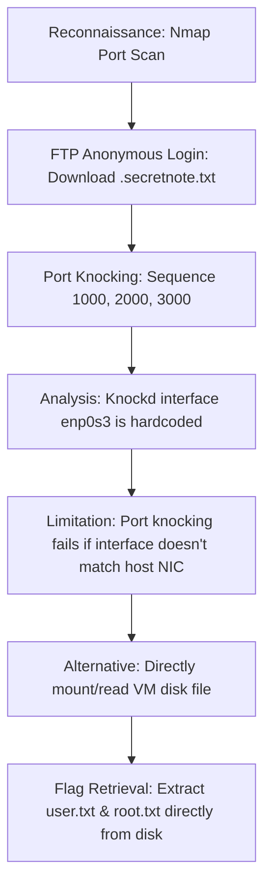

## 🖥️ Machine Information

<div class="hmv-info-card">
  <div class="hmv-card-header">
    <div class="htb-header-left">
      
      <div>
        <h3 class="hmv-machine-title">Alzheimer</h3>
        <span style="font-size: 0.85rem; color: var(--text-secondary);">Linux</span>
      </div>
    </div>
    <span class="hmv-diff-badge easy">EASY</span>
  </div>

  <div class="hmv-meta-row" style="grid-template-columns: repeat(4, 1fr);">
    <div class="hmv-meta-col">
      <span class="hmv-meta-label">Platform</span>
      <span class="hmv-meta-val orange">HackMyVM</span>
    </div>
    <div class="hmv-meta-col">
      <span class="hmv-meta-label">OS</span>
      <span class="hmv-meta-val">🐧 Linux</span>
    </div>
    <div class="hmv-meta-col">
      <span class="hmv-meta-label">Difficulty</span>
      <span class="hmv-meta-val">Easy</span>
    </div>
    <div class="hmv-meta-col">
      <span class="hmv-meta-label">IP Address</span>
      <span class="hmv-meta-val" style="font-family: monospace; font-size: 0.95rem;">192.168.56.108</span>
    </div>
  </div>
</div>

---

## 🧠 Attack Path Overview



> [!NOTE]
> This writeup details the complete attack path for the **Alzheimer** machine on the **HackMyVM** platform.

---

## 🔍 Phase 1: Reconnaissance & Enumeration

### 1. Host Discovery & Port Scanning
We scan the target using Nmap to find open ports and services:

```bash
nmap -p- -sC -sV 192.168.56.108
```

#### Open Ports:
```text
PORT      STATE    SERVICE VERSION
21/tcp    open     ftp     vsftpd 3.0.3
22/tcp    filtered ssh
80/tcp    filtered http
```

Only FTP is open. SSH (port 22) and HTTP (port 80) are filtered by the firewall.

### 2. FTP Anonymous Enumeration
Anonymous login is allowed. We log in and list the contents:

```text
ftp> ls -lah
drwxr-xr-x    2 0        113          4096 Oct 03  2020 .
drwxr-xr-x    2 0        113          4096 Oct 03  2020 ..
-rw-r--r--    1 0        0              70 Oct 03  2020 .secretnote.txt
```

We retrieve and read `.secretnote.txt`:

```text
I need to knock this ports and
one door will be open!
1000
2000
3000
```

---

## 🚀 Phase 2: Vulnerability Analysis & Port Knocking

### 1. Port Knocking Execution
We execute a port knocking sequence targeting ports `1000, 2000, 3000` via TCP:

```bash
knock 192.168.56.108 1000 2000 3000 -v -d 1000
```

```text
hitting tcp 192.168.56.108:1000
hitting tcp 192.168.56.108:2000
hitting tcp 192.168.56.108:3000
```

After multiple attempts, we verify that the port is still filtered and does not open.

### 2. Knockd Interface Analysis & Issue
Since the ports did not open, we inspect the virtual machine's disk file to check the `knockd` configuration:

```text
# /etc/knockd.conf
[options]
        UseSyslog
        Interface = enp0s3
[openSSH]
        sequence = 1000,2000,3000
        seq_timeout = 15
        tcpflags = syn
        start_command = /sbin/iptables -I INPUT -s %IP% -p tcp --dport 80 -j ACCEPT;echo "Ihavebeenalwayshere!!!" >> /srv/ftp/.secretnote.txt;sleep 120;/sbin/iptables -I INPUT -s %IP% -p tcp --dport 22 -j ACCEPT
```

The configuration hardcodes the network interface to `enp0s3`:
`Interface = enp0s3`

In virtualization environments where the active adapter interface name is different (e.g. `eth0` or `enp0s8`), `knockd` cannot capture the incoming packets, meaning the knock sequence fails to trigger the firewall rule.

---

## ⚡ Phase 3: Mounting Disk & Flag Extraction

Since rewriting the target system files isn't possible directly over the network, we mount the virtual machine's disk image (`.vmdk` / `.vdi` file) locally to extract the flags:

### 1. User Flag
We navigate to the user `medusa` home folder inside the mounted filesystem:

```bash
cat home/medusa/user.txt
```
Output: `HMVrespectmemories`

### 2. Root Flag
We read the root flag from the root directory inside the mounted filesystem:

```bash
cat root/root.txt
```
Output: `HMVlovememories`
