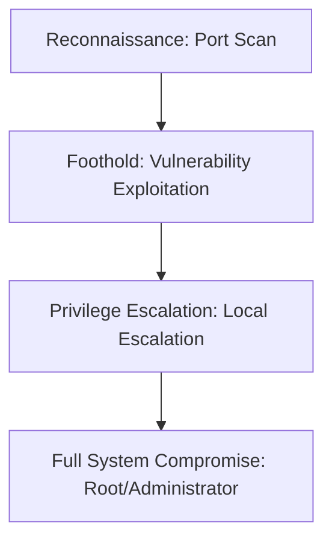

## 🖥️ Machine Information

| Attribute | Value |
|---|---|
| **Platform** | VulnHub |
| **OS** | 🐧 Linux |
| **Difficulty** | Easy |
| **IP Address** | `DHCP` |
| **Vulnerability Focus** | [Initial Access Vector / Privilege Escalation Mechanism] |

---

## 🧠 Attack Path Overview



> [!NOTE]
> This writeup details the complete attack path for the **Jetty** machine on the **VulnHub** platform.

---

## 🔍 Phase 1: Reconnaissance & Enumeration

### 1. Host Discovery & Port Scanning
We begin by running a standard Nmap scan to discover open ports and running services:

```bash
nmap -sC -sV -oN nmap.txt DHCP
```

#### Open Ports:
- **Port 80/tcp**: Web Server (Apache/Nginx)
- **Port 22/tcp**: SSH (OpenSSH)
- [Other open ports]

### 2. Service Enumeration
[Detail the enumeration steps, e.g., gobuster, nikto, smbclient, enum4linux, rpcclient]

```bash
gobuster dir -u http://DHCP/ -w /usr/share/wordlists/dirb/common.txt -o gobuster.txt
```

---

## 🚀 Phase 2: Vulnerability Analysis & Foothold

### 1. Vulnerability Analysis
- [State the vulnerability found and how it was discovered]
- **CVE/CWE Reference**: [e.g., CVE-202X-XXXX]

### 2. Exploitation & Initial Shell
- [Detail the step-by-step exploitation process to gain a shell]

```bash
# Example payload or exploit execution command
python3 exploit.py -t http://DHCP/vulnerable-endpoint
```

#### Capturing User Flag:
```bash
cat /home/*/user.txt
# [User Flag Hash]
```

---

## ⚡ Phase 3: Privilege Escalation

### 1. Local Enumeration
- [Detail tools and commands run, e.g., linpeas, winpeas, sudo -l, find SUID]

```bash
# Check sudo permissions
sudo -l

# Search for SUID binaries
find / -perm -4000 2>/dev/null
```

### 2. Local Privilege Escalation Path
- [Step-by-step instructions to escalate privileges to root/administrator]

```bash
# Example privilege escalation exploit or command
sudo /usr/bin/binary -e 'exec /bin/sh'
```

#### Capturing Root Flag:
```bash
cat /root/root.txt
# [Root Flag Hash]
```

---

## 🛡️ Key Takeaways & Mitigation
1. **Input Sanitization**: Ensure all user inputs are validated and sanitized.
2. **Principle of Least Privilege**: Restrict sudo permissions and remove unnecessary SUID bits.
3. **Keep Software Updated**: Patch services to mitigate known CVEs.
